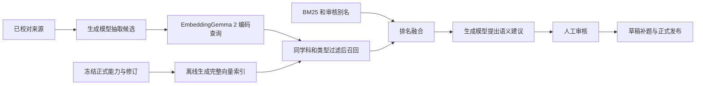

# EmbeddingGemma 2 对学习系统的增益分析

分析日期：2026-10-07（Asia/Shanghai）  
结论性质：官方资料核验 + 当前仓库代码审查 + 本机模型目录只读核对；未下载模型、未运行该模型、未测量本机检索质量。  
代码观察基线：检查时 HEAD 为 `ab9133d`，工作区另有建库阶段追踪等未提交改动。本文描述检查时的实现，不把代码存在等同于线上已验收。

## 1. 结论与建议

**有增益，最值得用于“能力候选 → 正式能力库”的真实语义召回；建议先做文本检索对照实验，再决定是否接入生产。**

当前系统已经有本机生成模型、人工审核、关键词检索、模拟向量和语义判断任务。缺少的不是再加一个聊天模型，而是让不同措辞的能力描述更容易找到相关正式定义。EmbeddingGemma 2 输出向量，适合补这一环。

它不能直接解决教材扫描识别错误、生成 JSON 不合规、引用与原文不一致、候选缺少测量题等问题，也不会自动提高判分和掌握评估的可靠性。若目前主要目标是把二年级除法教材形成可用内容，来源校对、候选审核和测量题补齐仍应优先。

建议顺序：**修稳教材与审核闭环 → 小规模文本向量实验 → 持久调用与索引接入 → 教材页面图像检索**。无需先引入独立向量数据库，也无需一次启用全部模态。

## 2. 模型身份与已核验信息

这里讨论的是 Google 的开源 **EmbeddingGemma 2**（`google/embeddinggemma-2`），不是云端 Gemini Embedding 2，也不是 Gemma 2 聊天模型。

官方开发指南发布于 2026-10-06：完整模型约 740M 参数，纯文本配置约 270M，文本加视觉约 440M；支持统一的文本、图像、音频和视频向量，原生维度 768，上下文 8,192 token，提供 512/256/128 维截取选项，采用 Apache 2.0 许可。[官方开发指南](https://developers.googleblog.com/en/embeddinggemma-2-the-developer-guide/)

官方模型卡的多语言文本 MTEB v2 汇总分数为 61.36，前代为 61.15；代码任务分数从 68.76 到 78.68。**约 14% 的宣传提升指代码基准，不能套用到中文小学数学检索。** 数学能力边界、竖式和教材版面仍需自己的测试集。[官方模型卡](https://ai.google.dev/gemma/docs/embeddinggemma/model_card_2)

推理指南要求使用适配的任务前缀、正确池化与归一化；默认加载全部编码器，纯文本需显式关闭视觉和音频。官方原始推理不应使用 float16 激活，建议 bfloat16 或 float32。Apple Silicon 的具体运行后端、量化实现和精度需要另行验证。[官方推理指南](https://ai.google.dev/gemma/docs/embeddinggemma/inference-embeddinggemma-with-sentence-transformers)

## 3. 当前系统实际有什么

### 3.1 正式建库仍使用模拟向量召回

代码证据：

- [`Retrieval.cs`](../../src/server/Domain/Retrieval.cs)：128 维字符双字哈希特征，空间为 `mock/local-char-bigram/1/128/normalization-1`。它能验证向量空间隔离，不等于语义模型。
- [`BuilderLexicalRetrieval.cs`](../../src/server/Domain/BuilderLexicalRetrieval.cs)：字符双字 BM25 与向量排名通过 RRF 融合，审核别名优先。
- [`Builder.cs`](../../src/server/Domain/Builder.cs)：保存候选时仍调用上述召回；同学科、同能力类型过滤，允许跨年级关联。
- [`BuilderSemanticJobs.cs`](../../src/server/Domain/BuilderSemanticJobs.cs) 与 [`BuilderSemanticProcessing.cs`](../../src/server/Domain/BuilderSemanticProcessing.cs)：已有独立语义判断队列，提出关联、新建、拒绝或待审核建议；输入仍受原召回结果限制。

因此真实 embedding 的直接切入点是**召回层**。生成模型能判断“找来的这些能力是否相同”，但若正确能力根本没被召回，后面的判断也无法补救。

### 3.2 已有真实向量接入基础，但未完成生产链路

- [`LocalEmbeddingProvider.cs`](../../src/server/Domain/LocalEmbeddingProvider.cs)：认证访问本机 `/v1/embeddings`，返回原响应与实际用量；代码明确尚未注册到正式生成链路。
- [`ModelEmbeddings.cs`](../../src/server/Domain/ModelEmbeddings.cs)：验证模型、对象修订、输入摘要、维度与向量数值，进行归一化和完整库检索。
- [`ModelEmbeddingIndex.cs`](../../src/server/Domain/ModelEmbeddingIndex.cs)：固定正式发布、模型空间、能力修订及完整向量快照；目前上限 512 个能力。
- [真实向量运行手册](../runbooks/model-embeddings.md)：实际工件核验、持久调用账本、共享预算和冻结索引任务尚未全部衔接。

接入可复用这些基础，但不能只改一个模型名称就宣称完成。

### 3.3 本机与上游支持要分开看

本次读取本机 `GET http://127.0.0.1:8000/v1/models` 成功，返回六个目录项（Qwen、Gemma 生成模型及 MarkItDown），**没有列出 EmbeddingGemma 2**。这只说明当前服务目录没有提供它，不证明磁盘上绝对没有模型文件。

oMLX 上游 README 已明确列出 EmbeddingGemma 2；其 embedding 请求结构也提供文本输入和文本/图像结构化输入，图像要求内联 data URI。这些事实说明存在适配路线，**不证明本机已安装版本具有同样能力**。模型本身支持音视频，也不代表 oMLX 当前接口暴露了全部音视频能力。[oMLX 上游](https://github.com/jundot/omlx)、[embedding 请求定义](https://github.com/jundot/omlx/blob/main/omlx/api/embedding_models.py)

## 4. 对业务的具体增益

以下是根据模型能力与系统结构作出的推断，尚未通过本项目实测。

| 场景 | 潜在增益 | 当前优先级 | 限制 |
|---|---|---|---|
| 候选能力寻找已有能力 | 改善异名同义、不同情境下相同测量目标的召回 | 高 | 相近主题不等于同一能力，仍须核对边界 |
| 题目、课时、资源的映射建议 | 找到用词不同的相关能力，缩小人工核对范围 | 中高 | 当前输入对象只支持 KC/Candidate，其他对象需要扩展 |
| 找回教材依据 | 用能力描述检索相关页或段落，帮助审核人定位证据 | 中 | 需单独的来源索引；召回不替代逐字引用 |
| 扫描教材页面图像检索 | 可绕开部分 OCR 词汇缺失，定位含图表或竖式的页面 | 后续 | 是页面检索，不是精准 OCR 或算式解析 |
| 候选聚类与重复提示 | 把类似候选放在一起核对，减少来回浏览 | 中 | 不可据此自动合并能力和历史证据 |
| 孩子判分、掌握概率、复习间隔 | 没有直接增益 | 不纳入此次范围 | 由题目规则、人工判分和证据规则负责 |

举例：“每份同样多，求能分几份”和“包含除法求份数”可能表达接近的目标，真实向量有机会改善召回；“有余数的除法竖式”与“租船时余数要进一”虽然都谈余数，却分别涉及计算程序与情境决策，不能因为相似度高就关联为同一能力。

如果正式能力库只有少量三年级混合运算定义，而候选来自二年级除法，检索模型无法创造库中不存在的正式能力。实验必须包含相应除法能力及难区分的反例，不能把“无匹配”一概判作模型失败。

## 5. 接入后的架构与关键改动

这张图是建议方案，当前正式召回尚未使用 EmbeddingGemma 2。

### 5.1 首先采用文本检索

查询包含候选名称、独立可测行为和排除边界；文档包含正式能力名称、行为和边界。已有实际测量题可用于后续重排或语义核对，避免把大量题干拼接后掩盖能力定义。

应对照测试官方 SearchQuery/Document 的非对称检索与 STS 的对称相似任务，不默认认为两者等效。现有客户端仅发送普通字符串，且固定预处理为 NFKC、trim、小写，未显式编码任务前缀、文档标题或模态。接入需新增固定、可审计的输入配方；检查 oMLX 是否自动添加前缀，避免重复添加。[官方任务格式说明](https://ai.google.dev/gemma/docs/embeddinggemma/inference-embeddinggemma-with-sentence-transformers)

空间身份至少固定：模型工件摘要、运行实现与版本、权重量化/数值精度、输入配方、池化、任务前缀、输出维度、截取与归一化版本。查询和文档可以使用对应的不同前缀，但必须属于同一套经过评测的配方。当前结构未显式保存的项目需增加字段或纳入冻结配方版本，不混用新旧空间。

先以 768 维为参考，再测试 256 维是否足够；截取后重新 L2 归一化，查询与库维度一致。当前传输不请求降维，因此降维应作为显式新增配置和协议能力，不能偷偷截取返回值。

### 5.2 补齐持久调用与索引任务

索引构建应记录待处理、调用中、验证、完成或失败；调用共享家庭模型名额与预算。冻结发布及输入，在锁外等待推理，提交时重新核验权限、原发布、撤回状态和输入摘要。只有完整通过验证的索引才能参与正式召回。

保存原响应、实际 Token/未知用量、模型工件和配置、延迟与索引摘要。取消等待不应推定模型已结束，也不应自动释放未知调用名额。恢复应保留旧失败事实，沿用现有后台任务保护机制。

模型不可用时，可明确显示降级到旧检索，或停止本次真实向量任务；不可把旧模拟结果标成模型向量。升级模型必须创建新空间及新索引，原候选审核依据仍保留原版本。

### 5.3 多模态单独进入下一阶段

当前向量输入只允许 KC/Candidate 文本，客户端也不发送图像。教材页面索引需增加 SourcePage 等对象、原页图片摘要、页码、图像预处理配方、家庭权限和原文件关联。

即使图像召回找到正确页，引用与数学符号仍需从可核对的原页和文本取得。embedding 不会输出逐字 OCR，不可让相似页替代原始证据。

## 6. 成本与为什么先不加向量数据库

按参数数量计算，270M 文本权重的两字节存储理论量约 540 MB；完整 740M 约 1.48 GB。这里只是权重的数量级估算，不是下载大小、峰值内存或本机实测；框架、激活、批处理和量化会改变实际占用。不能把手机端特定优化结果套用到 Mac 上。

对当前索引上限 512 个能力，float32 原始向量容量：

| 维度 | 512 个向量的二进制容量 |
|---|---:|
| 768 | 1.5 MiB |
| 256 | 0.5 MiB |

现有实现保存 JSON 并使用 double 数值，数据库和运行时占用会比上述二进制估算更大。即便如此，小能力库首先采用现有完整快照与精确余弦检索较合适；新增向量数据库的部署与版本管理成本可能超过检索收益。

若以后扩展到数万题目或教材页面，再评估 PostgreSQL 向量扩展或专门索引。当前 512 能力上限、只支持两类对象和整份 JSON 快照的设计届时也需要调整，不能仅增加 ANN 就视为完成扩容。

本地推理没有外部模型账单，但有下载、磁盘、内存、耗电和与生成模型竞争资源的成本。实际本机版本、模型格式、冷启动、常驻内存和并发延迟均待验证。本次未修改服务或下载模型。

## 7. 能否胜过前代或其他模型

“从模拟哈希向量换成经过训练的语义向量”与“EmbeddingGemma 2 胜过其他真实模型”是两个问题。前者有明确的结构价值；后者目前没有本项目证据。

多语言通用基准较前代只小幅变化，所以单纯中文能力文本检索不能仅凭版本号决定升级。第二代更吸引当前系统的长期价值是教材图片与文本的统一检索。官方基准不是中文小学数学领域的准确率承诺。[官方模型卡](https://ai.google.dev/gemma/docs/embeddinggemma/model_card_2)

对照至少包括：现有混合检索、纯 BM25、EmbeddingGemma 2 混合检索；资源允许时再加入一个可在本机验证的真实文本 embedding 基线。保持相同语料、学科/类型过滤、TopK、别名规则与人工标签，不拿不同配置的分数直接比较。

## 8. 最小验证实验与进入生产的条件

建议先准备 100～150 条中文查询，其中覆盖同义改写、不同情境、无库内匹配、OCR 噪声，以及至少 30 条“词汇很像但能力不同”的反例。标注相关能力和关联/新建/拒绝/信息不足结果；独立核对金标准，保留有争议标签，不能用模型自己的答案充当金标准。

分开报告两类结果：

1. **召回质量**：Recall@5/10、MRR、nDCG；仅对有库内目标的样本计算目标召回，无匹配样本单独统计误提示。
2. **业务收益**：审核耗时、错误关联提示数、每个候选的人工查找次数；同一生成模型和固定输入下，比较不同召回导致的语义建议变化。

同时记录查询编码和端到端 p50/p95、首轮建库时间、冷启动、常驻/峰值内存、与生成任务并行时的资源占用。分 768/256 维、原始精度/经验证量化配置报告，拒绝 NaN/零向量和错误维度。

可预先采用以下**建议验收门槛，并非已达到的结果**：

- 有目标样本的 Recall@10 相对当前基线提高至少 10 个百分点；若基线已接近上限，则召回不下降且人工审核耗时降低至少 20%。
- 难反例中的错误关联提示不增加；相似度永远不触发自动接受、发布或掌握证据迁移。
- 热状态单候选的召回流程 p95 暂定不超过 1.5 秒，CPU/内存不影响孩子正常作答；这个预算可结合本机实测调整。
- 完成真实模型响应、错误/取消/恢复、索引工件核验、跨家庭权限、版本隔离和撤回验证。

若收益不明显，保留现有关键词与人工审核，暂缓生产接入；不为“已接入新模型”增加维护负担。

## 9. 最终决策

**建议立项一个范围有限的本地文本检索实验，不建议现在直接全面替换生产召回。**

先验证本机 oMLX 版本及可用模型工件，再用冻结能力库进行离线对照。实验通过后，把真实向量接入现有混合召回和语义判断队列，保留人工审核。页面图像检索是第二阶段，不与第一次文本接入捆绑。

EmbeddingGemma 2 对系统最可能的贡献是“找得更全、审核定位更快”，而当前教材库真正完成仍取决于来源正确、能力边界明确、测量题齐全和正式审核发布。没有实测前，不给出教材建库成功率或总体完成度提升百分比。
