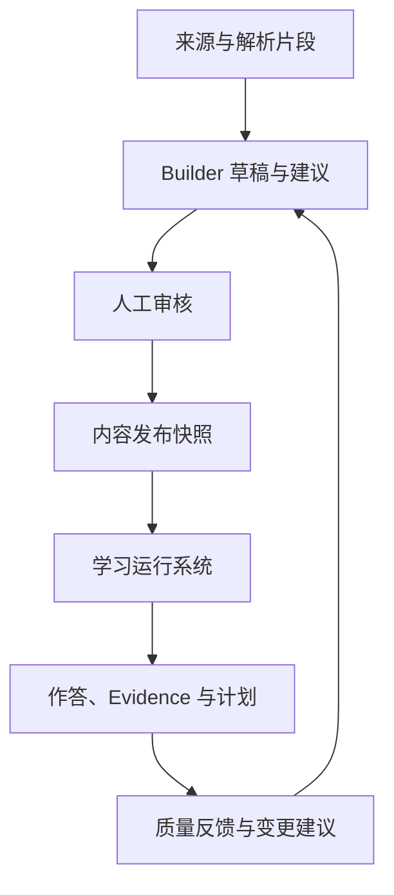

# 家庭学习系统开发设计 v1.1

> 日期：2026-10-01  
> 状态：开发基线建议稿，可用于需求拆解与技术设计；尚未完成代码实现、性能测试和教育效果验证  
> 对象：产品负责人、前端、后端、测试、内容维护者  
> 合并来源：《家庭学习系统设计文档》v1.0、《KC 自动生成与演化设计文档》v0.1，以及本次设计审查  
> 首期场景：三年级孩子家庭自用，一个数学单元；英语听力和阅读仅作为固定任务模板

## 0. 文档地位与阅读方式

本稿整合学习系统与 KC Builder，保留原文档作为背景，不覆盖原文件。发生冲突时，本稿规定的 V1 范围、数据版本、证据生成和发布规则优先。原文中的算法阈值、样例掌握状态和工期不再直接视为验收标准。

- 产品与前端重点阅读第 1、2、8、9、10、11 节。
- 后端重点阅读第 3～10、12～14 节。
- KC Builder 开发重点阅读第 4～6、12、15 节。
- 测试重点阅读第 7～10、13、15、16 节。
- 第 17 节列出开发启动前需要确认的项目输入，不影响先做工程基础和测试夹具。

“必须”表示 V1 硬约束；“默认”表示可通过版本化配置调整；“后续”表示不纳入首期发布。

### 0.1 关键修订

| 原设计问题 | 本稿处理 | 开发影响 |
|---|---|---|
| 两份文档的 V1 范围不一致 | 分为学习运行系统 L1 和 KC Builder K1 | 独立上线、独立验收，L1 不依赖 AI 在线可用 |
| AI 结果可能直接写正式 KC/映射 | 草稿 → 审核 → 不可变发布版本 | 未发布数据不得影响作答和掌握度 |
| KC 身份和版本混用 | 稳定身份 + 定义修订版本 | 作答保留当时使用的定义和映射 |
| 多 KC 题目分摊整题对错 | 内容关联与测量归因分开 | 无步骤证据不推断所有能力对错 |
| 相似度和 LLM 自报分数被当概率 | 分数只用于检索/审核排序 | 不按 0.95 等固定值自动放行 |
| 同一题反复答对可累计掌握度 | 学习会话、首次证据、重复限制 | 重试不重复生成学习证据 |
| 2/7/30 天间隔语义含糊 | 明确首次 +2、之后 +5、再 +23 天 | 无延期时对应第 2、7、30 天 |
| 已发布计划重生成可能丢任务 | 稳定任务身份与计划修订分离 | 已完成、进行中、锁定任务保留 |
| 原文离线作答属于首期硬要求 | L1 先在线提交；离线作答是 L1.1 | 缓存页不得伪装成已同步 |
| 16 周看似确定承诺 | 采用里程碑及 14～18 周估算区间 | 四周家庭观察单独计时 |

## 1. 产品边界与交付分层

### 1.1 产品目标

孩子打开平板只需要看到“今天做什么”；家长可以快速确认学校进度、调整当天任务、记录纸质结果和理解复习依据。系统以可追溯的作答证据更新 KC 状态，在时间预算内提出下一步建议。

系统不是教师替代品，也不是标准化测评系统。V1 的“掌握概率”是家庭安排用的模型分数，不是经过验证的真实能力概率，更不能直接等同于考试正确率。

### 1.2 独立交付范围

| 分层 | 必须交付 | 不依赖/暂不做 |
|---|---|---|
| L1 学习运行系统 | 学生、进度、目标、资源入口、任务、作答、人工判分、错题、复习、Evidence、掌握状态、规则计划、周汇总 | 不依赖 LLM/OCR；不做自动手写判分、复杂知识追踪 |
| K1 KC Builder | 受控来源导入、文本解析、候选抽取、相似检索、归并建议、映射建议、人工审核、发布、运行记录 | 不自动创建正式 KC；不自动修改正式映射；不自动 Split/Merge |
| L1.1/P1 | 离线提交队列、完整步骤编辑器、更丰富周报、资源健康检查 | 不能作为 L1 核心里程碑的前提 |
| K2/P1 | OCR 草稿、批量导入扩展、经校准的低风险自动通过、人工迁移工具 | 必须先建立评测集、抽检和撤销能力 |
| 后续研究 | 数据驱动拆分/合并建议、题目难度校准、IRT/BKT、生成题 | 单家庭数据不支持大样本效果结论 |

K1 失败或模型不可用时，L1 继续使用已发布内容。内容可以人工编辑审核发布，发布流程不是 AI 专属。

### 1.3 首期内容上限

- 一个已确认教材版本，孩子当前正在学习的一个数学单元。
- 首批 8～15 个可测 KC，不要求等于教材目录数量。
- 初始 20 道回放题，随后扩展到 100～300 道经过答案与映射审核的题。
- 10～20 个合法可用资源；纸质页码、家长上传文件和外部链接均可。
- KC Builder 使用 50～100 道独立人工标注题评测；小样本只能支持试用，不能证明泛化准确率。
- 支持数据模型中的多个学生，但首期验收只用一个家庭；额外家庭也必须隔离。

### 1.4 不纳入首期

全学段内容平台、无限推荐流、社区、商城、实时课堂、持续摄像监控、情绪识别、跨平台抓取绕过限制、未经授权教材传播、微服务拆分、多租户商业计费。

## 2. 角色、关键流程与验收故事

### 2.1 权限矩阵

| 操作 | Child 子会话 | Parent | ContentEditor | Publisher |
|---|---|---|---|---|
| 查看本人今日任务/打开允许资源 | 是 | 是 | 按家庭授权 | 按家庭授权 |
| 提交本人答案/完成任务 | 是 | 可代录并注明来源 | 否 | 否 |
| 查看完整答案与解析 | 提交后按提示策略 | 是 | 是 | 是 |
| 创建目标、调整预算与计划 | 否 | 是 | 否 | 否 |
| 创建错题、人工判分、更正结果 | 否 | 是 | 否 | 否 |
| 编辑内容草稿、审核候选 | 否 | 可被授予编辑角色 | 是 | 是 |
| 发布内容、回滚活动版本 | 否 | 可被授予发布角色 | 否 | 是 |
| 导出/删除家庭数据 | 否 | 是 | 否 | 否 |

家庭自用可由一个家长承担三种管理角色，但服务端仍分别校验。所有对象读写必须验证家庭归属；不能因为客户端传了 StudentId 就信任。

### 2.2 五个端到端故事

| 编号 | 用户故事 | 完成条件 |
|---|---|---|
| US01 | 家长确认今天学校学到某课时 | 今日复习候选关联已发布 LessonKC，支持纠正进度且留审计 |
| US02 | 孩子依次完成今日任务 | 可打开资源、作答、继续任务；无效资源可报告，完成不等于掌握 |
| US03 | 家长录入纸质错题 | 原图私有保存，可录入正文/答案/KC；未审核归因不产生 KC 证据 |
| US04 | 系统安排到期复习 | 到期条目进入候选，预算不足保留到期状态，完成后更新日程 |
| US05 | 管理员导入教材生成 KC | 来源可定位、候选可校正、正式发布后才可被运行系统使用 |

### 2.3 家长工作量目标

学校进度采用上次位置、最近课时和一键确认；长期目标用模板；纸质错题先允许“图片 + 学科 + 待校正”，不强迫当日填完所有字段。待校正错题可以提醒家长，但不自动诊断孩子能力。

稳定使用后的目标是日均管理不超过 3 分钟、每周内容维护不超过 30 分钟。首次建库和集中审核单独计时，不能混入“日均 3 分钟”掩盖建设成本。

## 3. 架构与工程组织

### 3.1 技术路线

沿用 Vue 3 + TypeScript PWA、ASP.NET Core 模块化单体、PostgreSQL、兼容 S3 的私有对象存储。K1 相似检索可使用 pgvector；部署环境不支持时先用小规模内存检索，不引入新的分布式平台。

框架、数据库、SDK、模型和扩展的具体版本，在开发启动时验证支持周期后锁定，并记录于依赖清单。本文不宣称任何具体版本为当前最新或长期受支持版本。

后台任务初期采用同库任务表与 Outbox，Worker 可与 API 同部署。API 请求不阻塞等待教材解析或 LLM 批处理。

### 3.2 发布边界



运行系统不读取 Builder 草稿表。权限、状态检查和查询层三重约束，不能只靠前端隐藏未审核按钮。

### 3.3 模块边界

| 模块 | 拥有的数据与职责 | 依赖 |
|---|---|---|
| Identity/Family | 账户、角色、子会话、家庭和学生 | 无业务模块依赖 |
| ContentCatalog | KC、教材、课程、资源、题目、修订与映射 | 文件和家庭权限 |
| ContentPublishing | 审核决策、发布快照、活动内容版本 | ContentCatalog |
| KCBuilder | 来源、解析、候选、向量、模型任务与建议 | 只读正式内容；经发布模块产生正式结果 |
| Learning | 学校进度、目标、计划、任务、会话与作答 | 已发布内容 |
| Assessment | 判分修订、Evidence、掌握度投影 | 作答事件及固定内容版本 |
| Review | 错题关系、复习队列和日程 | 已判分事件；不以任务完成事件判定复习通过 |
| Planning | 候选、去重、规则打分、预算和发布 | 进度、目标、Review、Mastery、已发布内容 |
| Reporting | 周汇总、来源解释、数据质量状态 | 各模块只读模型 |
| Infrastructure | 对象存储、Outbox、任务、日志、备份 | 不承载教育规则 |

避免在 ORM 实体回调中直接调用 LLM、修改掌握度或发送通知。业务写入和 Outbox 在同一数据库事务提交。

### 3.4 建议代码结构

```text
src/server/Modules/{Identity,Content,Publishing,Builder,Learning,Assessment,Review,Planning,Reporting}
src/server/Infrastructure
src/web/apps/{child,parent,content}
src/web/shared
tests/{unit,integration,e2e,fixtures}
docs/{adr,api,runbooks}
```

前端共用一套应用和路由，不在首期维护三个独立构建。模块文件夹表示代码组织，不代表独立服务。

## 4. 数据约定与核心模型

### 4.1 全局约定

| 项目 | 约定 |
|---|---|
| 主键 | UUID；API 中为字符串，不从编码推导权限或逻辑 |
| 时间 | 事件时间用 UTC timestamptz；学校日期、计划日期、复习到期日期用学生时区的 date |
| 家庭隔离 | 私有业务表包含 FamilyId；跨表引用验证 FamilyId 一致 |
| 创建审计 | CreatedAt、CreatedBy；可变配置另有 UpdatedAt、RowVersion |
| 数值 | 权重/分数使用固定精度 decimal；模型分数保存原值，展示再四舍五入 |
| JSON | 仅用于结构化题干、学生答案、分数分解、模型输出等可变结构；核心关系用外键 |
| 软删除 | 内容用废弃/撤回；学习证据用撤销事件；隐私删除允许最终物理删除 |
| 并发 | 配置修改、计划调整、审核发布使用 RowVersion/ETag |
| 版本 | ContentReleaseId、EvidenceRuleVersion、MasteryModelVersion、PlanRuleVersion 分开 |
| 可重算 | 相同固定输入、规则、截止时间和排序，得到相同输出；不调用实时 LLM |

V1 的所有内容属于家庭私有空间。若未来引入共享内容包，新增显式授权和可见性规则，不能将 FamilyId 设空就默认公开。

### 4.2 家庭、学生、进度和目标

| 实体 | 关键字段 | 约束 |
|---|---|---|
| Family | Id、Name、OwnerAccountId | 家庭负责人可导出与删除 |
| FamilyMembership | FamilyId、AccountId、Roles | 唯一 (FamilyId, AccountId) |
| ChildSession | Id、FamilyId、StudentId、ExpiresAt、RevokedAt | 只能操作本人允许的任务，无内容管理权限 |
| Student | Id、FamilyId、DisplayName、Grade、Semester、TimeZone、DailyStudyMinutes、Status | 时区可验证；预算大于等于 0 |
| SchoolProgress | StudentId、LessonRevisionId、ProgressDate、Status、SourceType、RawSourceId、RowVersion | 唯一 (StudentId, ProgressDate, LessonRevisionId) |
| LearningGoal | StudentId、Subject、CourseId?、KCId?、GoalType、TargetValue、Period、ScheduleRule、Priority、StartDate、EndDate、Status | 无 KC 的阅读/听力目标不产生 KC 掌握证据 |
| DailyAvailability | StudentId、PlanDate、AvailableMinutes、ReservedMinutes、Note | 唯一 (StudentId, PlanDate)；未录入时使用学生默认预算 |

SchoolProgress 的 SourceConfidence 是来源可靠性提示，不是孩子能力置信度。更正学校进度影响未来计划，不追溯删除历史作答。

### 4.3 来源、文件与解析

| 实体 | 关键字段 | 约束 |
|---|---|---|
| FileObject | Id、FamilyId、ObjectKey、ContentHash、MimeType、Bytes、ScanStatus、Status | 私有桶；客户端不能指定任意 ObjectKey |
| ContentSource | Id、FamilyId、SourceType、Title、Provider、OriginalUrl?、FileId?、SourceVersion、ContentHash、UsageScope、PermissionBasis、AllowExternalAI、RetentionPolicy、Status | 权限不明确的来源默认不发送外部模型、不公开、不再分发 |
| SourceChunk | Id、SourceId、ParserVersion、Locator、Text、TextHash、ExtractQuality、Status | Locator 保存页码/段落/题号/时间码；同内容解析可去重 |
| ProcessingRun | Id、FamilyId、Type、InputHash、ModelProvider?、ModelId?、PromptVersion?、EmbeddingSpaceId?、ConfigHash、Status、StartedAt、FinishedAt、Usage、ErrorCode | 不把供应商密钥写进记录；失败保留可重试信息 |

UsageScope 描述用户已提供的许可范围，例如家庭自用、允许模型处理、可共享等。它不是系统自动作出的法律判断。教材文件和学生照片使用不同来源类型与访问权限。

### 4.4 KC 身份、定义和关系

| 实体 | 关键字段 | 约束 |
|---|---|---|
| KnowledgeComponent | Id、FamilyId、Code、IdentityStatus | Code 在家庭内容空间内唯一；发布后不复用 |
| KnowledgeComponentRevision | Id、KCId、RevisionNo、NodeKind、Name、Description、KCType、Subject、Domain、GradeMin、GradeMax、DifficultyLevel、CognitiveLevel、MeasurableBehavior、Boundary、RequiredCoverage、MeasurementSignature、RevisionStatus | 唯一 (KCId, RevisionNo)；已发布修订不可原地编辑 |
| KnowledgeComponentAlias | Id、KCId、Alias、NormalizedAlias、SourceId?、ReviewDecisionId、Status | 同一表达可因学科不同指向不同 KC；检索不得只用 Alias |
| KnowledgeRelationRevision | Id、FromKCId、ToKCId、RelationType、Strength、SourceRefs、ReviewDecisionId、Status | 无自环；发布时检查 prerequisite 有向环 |
| KCChangeProposal | Id、ProposalType、Rationale、Status、CreatedBy、ReviewedBy | ProposalType=Split/Merge/Redirect；V1 可人工记录，不自动执行 |
| KCChangeProposalItem | ProposalId、Side、KCId、ProposedRevisionId?、Weight? | 支持多来源、多目标，不用单一 TargetKCId 表达拆分 |
| KnowledgeMigration | Id、ProposalId、FromKCId、ToKCId、MigrationType、Weight、EffectiveReleaseId | 迁移不篡改历史 Evidence；默认不复制掌握状态 |

KCType 默认使用 Concept、Procedure、Representation、Strategy、Application、Expression。列表用于检索和审核，不代表教育学标准分类。

NodeKind=Measurable/Directory；只有 Measurable 参与测量、掌握度和可测 KC 质量指标。首期可以不创建目录节点；若创建，不能因为它没有测量题就算孤立能力。KC 的 DifficultyLevel 是能力复杂度描述，不替代题目的 Difficulty 因子。

KC 不绑定某一本教材。KC Code 可包含方便理解的初始年级，但年级变化不改 Code；GradeMin/GradeMax 属于定义修订字段。

Parent 与 Prerequisite 只保存在 KnowledgeRelationRevision。删除可业务写入的 ParentId；如为页面导航保留缓存，必须由关系投影生成。

Prerequisite 的方向固定为“前置能力 → 后续能力”。规划器查询目标的入边找到前置能力。Related、Equivalent 用规范化端点避免反向重复；Equivalent 不直接复制学生掌握度。

### 4.5 内容与修订

| 实体 | 关键字段 | 约束 |
|---|---|---|
| Textbook | Id、Publisher、Edition、Subject、Grade、Semester、SourceId | 版本明示，不以标题自动合并 |
| TextbookUnit | Id、TextbookId、Title、Sequence | 教材层级不作为 KC 身份 |
| TextbookLessonRevision | Id、LessonId、RevisionNo、UnitId、Title、Sequence、EstimatedMinutes、SourceRefs | LessonId 是稳定课时身份，Id 是内容修订 |
| Course / CourseLesson | Id、Provider、Subject、Title、Sequence、SourceRefs | 可选；首期外部英语课程只作为任务来源 |
| LearningResourceRevision | Id、ResourceId、RevisionNo、Subject、GradeMin、GradeMax、Title、ResourceType、Url?、FileId?、PaperReference?、DurationSeconds?、EstimatedMinutes、SourceId、QualityStatus | 外链/PDF/音频/纸质引用统一；不能承诺第三方资源离线可用 |
| QuestionRevision | Id、QuestionId、RevisionNo、Subject、GradeMin、GradeMax、QuestionType、Stem、AnswerSpec、Explanation、Difficulty、CognitiveLevel、EstimatedSeconds、SourceId、VariantGroupId?、QualityStatus | 标准答案、题干和判分规则变化必须产生新修订 |
| QuestionStepRevision | Id、QuestionRevisionId、Sequence、ExpectedAction、AnswerSpec、MaxScore | V1 支持少量人工评分步骤，不强制实现复杂步骤编辑器 |
| QuestionSetRevision | Id、QuestionSetId、RevisionNo、Title | 题集成员绑定 QuestionRevisionId 和顺序，不只绑定活跃题目 Id |
| QuestionSetItem | SetRevisionId、QuestionRevisionId、Sequence | 不能引用未发布题目 |

题目答案和解析仅从判分服务或授权接口返回。孩子“领取题目”响应不得附带 AnswerSpec，然后寄希望于前端不展示。

### 4.6 映射采用统一版本容器

用 MappingSetRevision + MappingItem 表达 LessonKC、QuestionKC、ResourceKC、StepKC 和可选 CourseKC；领域接口仍使用这些直观名称，但不维护重复事实表。

| 实体 | 关键字段 | 约束 |
|---|---|---|
| MappingSetRevision | Id、OwnerType、OwnerRevisionId、RevisionNo、ReviewStatus、ReviewDecisionId、EvidencePolicy | 一次映射修改创建整组新版本 |
| MappingItem | SetRevisionId、KCRevisionId、Role、CoverageWeight、EvidenceShare、EvidenceMode、Sequence、ModelScore?、SourceRefs | Role 和 EvidenceMode 分开；不能将覆盖权重直接当证据权重 |

EvidenceMode：None、WholeItem、StepObserved、ManualObserved。EvidencePolicy：NoEvidence、SingleKC、ObservedSteps。

- CoverageWeight 表示教学/内容覆盖，可用于资源匹配，范围 [0,1]，不强制所有 KC 的覆盖和为 1。
- EvidenceShare 表示一个可评分动作的证据预算份额，范围 [0,1]；同一动作所有可测 KC 的份额和不得大于 1。
- Question 映射中的 Prerequisite、Context 永远 EvidenceMode=None。
- V1 SingleKC 的一个题目只能有一个 WholeItem 测量 KC，通常为 Primary。
- 多能力综合题即使有 Primary，也可能必须 EvidencePolicy=NoEvidence，直到有独立步骤或人工观察结果。
- MappingItem 的 ModelScore 是模型排序分数；正式生效靠审核与发布，不靠该值高低。

### 4.7 Builder 草稿与审核

| 实体 | 关键字段 | 约束 |
|---|---|---|
| KnowledgeComponentCandidate | Id、RunId、DraftDefinition、SuggestedAction、ModelScore、ValidationFlags、Status、RowVersion | 模型输出不能直接更新正式 KC |
| KCCandidateEvidence | CandidateId、SourceChunkId、Excerpt、EvidenceKind、Locator | 引文必须可在源片段定位，不接受虚构页码 |
| CandidateMatch | CandidateId、ExistingKCRevisionId、Similarity、SemanticJudgment、RunId | 多个匹配目标可并存 |
| MappingSuggestion | Id、OwnerRevisionId、RunId、SuggestedItems、Status、ValidationFlags | 接受后生成映射草稿，不自动发布 |
| ReviewDecision | Id、SubjectType、SubjectId、Decision、CorrectedPayloadHash、ReviewerId、ReviewedAt、Reason | 保存原始候选、校正内容与审核理由 |
| EmbeddingRecord | Id、EntityType、EntityRevisionId、TextHash、EmbeddingSpaceId、Dimensions、Vector、RunId | 向量不写入 KC 主表 |

EmbeddingSpaceId 唯一标识 Provider + ModelId + 固定版本 + Dimensions + PreprocessingVersion。不同空间向量不能互相计算相似度；模型升级需要重新索引。

## 5. 审核、发布与版本迁移

### 5.1 发布数据

| 实体 | 关键字段 | 约束 |
|---|---|---|
| ContentRelease | Id、FamilyId、ReleaseNo、ParentReleaseId?、ManifestHash、Status、PublishedBy、PublishedAt | 发布后清单不可变；首期用完整快照简化运行查询 |
| ContentReleaseItem | ReleaseId、EntityType、EntityId、RevisionId、ItemHash | 唯一 (ReleaseId, EntityType, EntityId) |
| StudentContentBinding | StudentId、ActiveReleaseId、ChangedAt、ChangedBy | 切换只作用于未来新计划/新会话 |
| ReleaseWithdrawal | Id、ReleaseId、Reason、CreatedBy、CreatedAt | 紧急撤回可阻止新会话；不删除历史证据 |

发布快照包含 KC 定义、关系、课时、资源、题目、题集和映射版本。文件/来源记录作为固定内容的引用，不向孩子暴露原始来源权限。

### 5.2 发布前必须验证

1. 全部来源满足配置的使用范围；敏感图片没有误归为共享内容。
2. KC 有可测行为和边界；用于练习的 KC 至少有一道审核通过的测量题。
3. 所有映射引用的 KCRevision 同在清单内；题集题目、课时和资源引用完整。
4. 有效题型有可执行判分规则，答案经过审核；主 KC 归因策略合法。
5. Prerequisite 无环；关系端点存在；不自动从教材顺序推断强前置关系。
6. EvidenceShare 合法；NoEvidence 题目不会因 Primary 标记被错误测量。
7. 同一候选的并发审核不会创建两个正式 KC。
8. 审核人和发布权限有效；发布快照计算并保存内容哈希。

发布失败返回具体对象和错误码，不产生半个活动版本。无资源覆盖可列为警告，但该 KC 不得被安排无法执行的学习任务。

### 5.3 定义修订与实质变化

- 文案纠错、来源补充且测量含义不变：同一 KC 身份创建新 Revision。
- 测量范围变化、拆分、合并：创建新的 KC 身份和 Migration，不把它当作普通改名。
- 教材顺序变化：创建课时/映射修订，不改孩子既有 KC 证据。
- 同身份定义修订保留 MeasurementSignature；要改变该签名必须走新 KC 身份或显式迁移。
- 历史 StudentAttempt/Evidence 永远引用旧 Revision；当前 UI 可显示新版名称，但须可展开当时定义。

### 5.4 错误发布、更正与回滚

回滚活动内容版本只改变未来内容选择，不撤销历史结果。发现历史判分或映射确实错误时，单独创建 AssessmentCorrectionBatch：列出受影响作答、旧映射、修正映射、撤销及替代证据，预览影响后由家长确认执行。

仅发布更好的映射不能自动重解释过去所有作答。更正后的 Evidence 使用新的评估上下文，标明 CorrectionBatchId，并保留旧记录。

KC 拆分后新 KC 默认为 Unknown。V1 不按 Migration.Weight 把旧 alpha/beta 平摊过去；这种平摊会假定旧题测出了两个新能力，通常不成立。可以安排低成本诊断，后续有明确历史步骤数据时再做受控迁移。

## 6. KC Builder 工作流与质量控制

### 6.1 K1 处理流程

1. 家长/编辑上传允许使用的文本、文本型 PDF 或结构化题库，声明来源范围。
2. 校验文件类型、大小、扫描状态、哈希和重复导入；PDF 无文本层时标记 NeedsOCR，不输出假文本。
3. Parser 按页、章节、题号分段；记录 SourceChunk 和解析质量。
4. LLM 基于少量片段抽取可测能力，返回固定 JSON Schema；课程标题不自动变成 KC。
5. 验证必填字段、学科、年级范围、可测行为、边界、来源定位；失败则 NeedsRepair。
6. 名称标准化、Alias/关键词召回、Embedding Top-K 召回；V1 默认 K=10，可配置。
7. 按同学科和相容能力类型排序；年级/Domain 以宽范围或软过滤为主，避免漏掉跨年级同一能力。
8. LLM 语义判断输出 LinkExisting / CreateDraft / Reject / NeedsReview 和理由。
9. 人工查看来源、题目和最相近 KC，接受或校正；接受只生成草稿和 Alias 建议。
10. 题目/课时/资源生成 MappingSuggestion，经审核发布后供 L1 使用。

“Candidate 归并至已存在 KC”称 LinkExisting，不叫正式 KC Merge，以免混淆身份演化。Merge 两个已发布 KC 是另一个受控流程。

### 6.2 抽取协议最小字段

```json
{
  "schemaVersion": "kc-candidate/1",
  "candidates": [
    {
      "name": "两位数乘一位数进位计算",
      "subject": "MATH",
      "kcType": "Procedure",
      "gradeMin": 3,
      "gradeMax": 3,
      "measurableBehavior": "独立完成两位数乘一位数的进位计算",
      "boundary": "不包含应用题数量关系建模",
      "sourceChunkIds": ["chunk-01"],
      "supportingQuotes": ["来源中可定位的简短片段"],
      "modelScore": 0.9
    }
  ]
}
```

上例 Id 是说明用占位符，不是有效 UUID。正式 API 和 Schema 校验必须使用合法 Id。模型不自行编造正式 Code，Code 由审核后的发布服务分配并检查唯一性。

### 6.3 审核页面必须提供

- 候选名称、可测行为、边界、来源片段和定位。
- 支持题目及反例；相近 KC 的定义、边界、测量题。
- 模型/提示词版本、相似度、模型建议、校验警告。
- 接受新草稿、关联已有 KC、校正、拒绝、稍后处理。
- 批量确认限于同一审核条件，不能一个按钮通过全部低质量数据。

V1 不设置基于相似度的自动正式发布阈值。原文 0.88/0.95/0.97 仅作为实验参数，不能解释成概率或跨模型通用门槛。

### 6.4 模型故障与预算

ProcessingRun 保存费用/Token/耗时，设置单次输入上限、每日费用上限、并发上限与超时。默认失败重试 3 次，采用退避；Schema 错误可受控修复一次，仍失败交人工，不无限调用。

使用 InputHash + TaskType + ModelConfigHash + PromptVersion 保证同一处理请求可复用结果。工作任务采用租约和心跳，Worker 崩溃后可重新领取。外部模型调用无法保证物理上只发生一次，费用记录必须允许检测重试重复调用。

### 6.5 题库反推粒度与数据驱动演化

题库的能力描述聚类只产生“粒度问题建议”，不自动成为正式 KC。数字不同、题面不同和题目难度不同，不足以证明需要新 KC。

单个孩子的不进位 95%、进位 52% 可提示人工审查，不能直接视作普遍 Split 证据；题群本身难度不同、学习顺序不同也可能造成差异。K1 先记录样本量、题群组成、提示使用与重复题情况，群体统计和 IRT 后置。

### 6.6 评测集与指标定义

| 指标 | 计算口径 | 初期目标/解释 |
|---|---|---|
| 结构化输出成功率 | 首次输出可通过 Schema 的任务数 / 完成任务数 | 建议 ≥95%；修复后成功另报 |
| 主 KC 准确率 | Primary 与人工金标相符的独立题数 / 可测评题数 | 建议 ≥85%，仅为人工辅助工具可用门槛 |
| 映射覆盖率 | 有审核映射的有效题数 / 有效题总数 | 与准确率分开；拒绝映射不能假装准确 |
| Duplicate Rate | 人工认定重复正式 KC 对应的冗余节点数 / 正式节点数 | 建议 ≤5%；小库逐条检查 |
| Orphan Rate | 无教材/题目/资源正式关联的可测 KC 数 / 可测 KC 数 | 目录类节点不计入分母 |
| Review Time | 首次审核及校正分钟 / 每 100 题 | 建议 ≤30 分钟，记录真实结果，不作保证 |
| Source Traceability | 来源定位有效的候选数 / 候选数 | 必须 100% |

评测集冻结版本，开发调参集与最终检查集分开；同一题变式不能跨集合泄漏。保存不进位/进位、计算/建模、含零等易混淆反例。小样本报告正确条数和总数，不只写百分比。

K2 自动通过策略需要独立评测、错误严重度、校准记录、抽样复核及可撤销能力；LLM 自报 ModelScore 不能成为唯一放行依据。

## 7. 学习会话、判分与 Evidence

### 7.1 数据模型

| 实体 | 关键字段 | 约束 |
|---|---|---|
| LearningSession | Id、StudentId、LearningTaskId?、QuestionRevisionId、ContentReleaseId、MappingSetRevisionId、StartedAt、ClosedAt、Status | 一次独立遇题，不是每次网络请求一个会话 |
| StudentAttempt | Id、StudentId、SessionId、ClientSubmissionId、AttemptNo、Answer、HintEvents、SubmittedAt、AnswerSource、ContentReleaseId、QuestionRevisionId、MappingSetRevisionId | 唯一 (StudentId, ClientSubmissionId) 和 (SessionId, AttemptNo) |
| GradingRevision | Id、AttemptId、RevisionNo、Result、Score、Method、ConfidenceClass、ObservedAt、GradedBy、Reason | 首次判分和人工更正都追加修订；当前结果是投影 |
| StepAttempt | Id、AttemptId、StepRevisionId、Answer、ObservedResult、HintLevel、ObservedBy | 未观察到的步骤用 Unknown，不推断为错误 |
| AssessmentGeneration | Id、StudentId、EvidenceRuleVersion、ModelVersion、InputHash、Status、CreatedAt | 一次完整评估世代；Active/Shadow/Retired |
| StudentAssessmentBinding | StudentId、ActiveGenerationId、RowVersion | 活动证据与掌握投影的唯一切换指针 |
| AssessmentContext | Id、GenerationId、AttemptId、GradingRevisionId、MappingSetRevisionId、EvidenceRuleVersion、CorrectionBatchId?、ActivationStatus | 唯一 (GenerationId, AttemptId, GradingRevisionId, MappingSetRevisionId, EvidenceRuleVersion) |
| Evidence | Id、ContextId、StudentId、KCId、KCRevisionId、SourcePartId、Direction、RawWeight、EffectiveWeight、FactorBreakdown、OccurredAt、EventSequence、EvidenceType | 不可变；唯一 (ContextId, KCId, SourcePartId, Direction) |
| EvidenceRevocation | Id、EvidenceId、CorrectionBatchId、Reason、CreatedAt | 同一 Evidence 只能有效撤销一次 |
| AssessmentCorrectionBatch | Id、StudentId、Cause、AffectedAttemptIds、PreviewHash、Status、ConfirmedBy | 影响预览需固定输入，执行使用幂等键 |
| StudentMastery | StudentId、KCId、GenerationId、ModelVersion、ActiveEvidenceRuleVersion、Alpha、Beta、Probability、EffectiveEvidence、Counts、ConfidenceLevel、MasteryStatus、NeedsRecheck、LastAttemptAt、NextReviewDate、ProjectionCursor、UpdatedAt | 唯一 (StudentId, KCId, GenerationId)；当前查询只读 Binding 指向的世代 |

一次作答的 Evidence 可有正、负两个方向，因为不同步骤结果可能不同；不能将“净权重为正”当作所有步骤都正确。FactorBreakdown 留出审核来源、重复折扣、提示和延迟参数。

### 7.2 判分范围

| 题型 | L1 判分方式 | KC 证据限制 |
|---|---|---|
| Choice | 服务端按选项 Id 精确匹配 | 审核 SingleKC 题可生成证据 |
| Numeric | 按 AnswerSpec 规范化数值，是否允许小数/单位/容差由题目声明 | 不能用全局容差接受任意近似答案 |
| Fill | 明确可接受答案集合与规范化规则 | 有语义歧义时转人工 |
| ShortAnswer | 家长人工判分 | 不用字符串完全相等替代语义判分 |
| MultiStep | 少量人工观察步骤；无观察时只记录整题结果 | NoEvidence 或只生成已观察步骤证据 |
| 纸质/照片 | 家长代录结果并确认对应题目和 KC | 仅上传照片、勾完成不产生能力证据 |

规则判分结果和家长确认采用 Trusted。未确认的 OCR、模型判分采用 Pending，V1 不生成有效 KC 证据。ConfidenceClass 表示评估准入状态，不是 LLM 自报概率。

### 7.3 提交与事务顺序

1. 客户端领取 LearningSession，固定题目、映射和 ContentRelease；服务端返回不含标准答案的题面。
2. 服务端校验子会话、学生归属、任务状态、题目版本、会话是否可提交。
3. 同事务写 StudentAttempt、可执行的首次 GradingRevision 和 AttemptSubmitted Outbox。
4. Worker 创建 AssessmentContext，验证 EvidencePolicy 与准入门槛，生成 Evidence 和评估完成事件。
5. 更新 StudentMastery 投影及 Review 日程；分别记录消费游标和幂等处理结果。
6. 前端可立即看到规则判分结果，同时显示 assessmentStatus=Pending/Applied/NeedsReview，不把后台延迟当丢数据。

网络重试使用同一个 ClientSubmissionId。FirstAttempt、AttemptNo、ElapsedSeconds 和延迟天数由服务端会话记录决定，不信任客户端声明。

### 7.4 证据归因准入

| 场景 | Evidence 处理 |
|---|---|
| 已发布、审核 SingleKC 的直接计算题 | 首次结果对唯一 WholeItem KC 产生证据 |
| Secondary KC 只有内容关联 | None，不按整题结果分摊 |
| Prerequisite / Context | None |
| 多能力题最终错但未知错误位置 | 整题结果进入错题；KC 证据待人工确认 |
| 应用题列式正确、计算错误且步骤已观察 | 建模 KC 正证据、计算 KC 负证据；表达步骤 Unknown 不产生负证据 |
| 看完视频、读完 PDF、完成纸质任务 | 学习行为记录，不产生强正证据 |
| 未发布映射或草稿题目 | 不能创建正式学习会话；手工记录来源可以留待校正 |
| Pending 判分 | 不计入掌握度，不触发能力状态升降 |

Primary 是题目主要关联能力，不等于结果一定能唯一归因。审核者必须同时配置 EvidencePolicy。

### 7.5 Evidence 权重初始规则

公式仅是待试用校准的工程规则，不是科学验证结论：

```text
weight = EvidenceShare
       × qualityFactor
       × directionDifficultyFactor
       × independenceFactor
       × delayFactor
       × noveltyFactor
```

| 因素 | 正证据默认 | 负证据默认 | 约束 |
|---|---|---|---|
| qualityFactor | 审核题 1.0；可用但有局限 0.7 | 相同 | 正式不可测题不纳入，不靠低权重掩盖坏题 |
| directionDifficultyFactor | Easy=0.8，Medium=1.0，Hard=1.2 | Easy=1.2，Medium=1.0，Hard=0.8 | 显式分正负系数 |
| independenceFactor | 无提示 1.0、轻提示 0.7、强提示 0.4、已看答案 0 | Trusted 错误 1.0 | 提示后仍错误不自动打折；来源不可信直接 Pending |
| delayFactor | 非复测 1.0；2 天 1.1；7 天 1.25；30 天 1.4 | 1.0 | 延迟基于上次相关讲解/有效遇题时间；中途再教则重算 |
| noveltyFactor | 新题 1.0；已标记同构变式 0.8；原题 0.5 | 相同 | 变式关系未知不由 LLM 临时猜测 |

延迟门槛按实际 UTC 时长判定：2/7/30 天至少分别 48/168/720 小时；复习到期日期用于计划，不等于已满足高权重条件。

同一可评分动作的 EvidenceShare 和 ≤1；步骤间共享总预算，同一题所有已观察步骤的基础份额和 ≤1。遗漏步骤的预算不分给其他步骤。按当前参数，一次独立遇题的总有效证据上限为 1.68；发布校验和运行生成时都检查。

### 7.6 防止重复题污染

- 一个 LearningSession 的第 1 次提交在判分确认后生成基础证据；若第 1 次仍 Pending，不得挑后续正确答案顶替。后续试错答案保留行为记录，但不再增加独立证据。
- 首次错误后立即改对，不抵消首次负证据；“订正完成”与“延迟独立答对”分开。
- 同一 QuestionId 在任意滚动 24 小时最多一次有效遇题证据；不同修订号不能绕过该限制。
- 原题复测可以产生折扣证据，但 DistinctQuestionCount 仍只计一个 QuestionId。
- 已标记同构题共享 VariantGroupId；同一组的同日正证据总权重默认上限 2.0，不同题重复练仍可记录练习量。
- 任何截断量记录 SuppressedWeight 和原因；不能默默丢弃导致无法解释。
- 针对同一学生按固定的服务器事件顺序生成证据；先后事件和规则版本一起固定，重放不能按数据库自然顺序。

### 7.7 更正、撤销和模型升级

人工更正判分先生成新 GradingRevision，再在 CorrectionBatch 中撤销错误 Evidence 并产生替代 Evidence。Worker 幂等重试不能重复加分。

模型试验在 Shadow AssessmentGeneration/Projection 中运行。切换新的 EvidenceRuleVersion 时按学生执行一次受控重建，保持读侧切换原子性；旧版本留存供比较，但不能与新版本同时累加。V1 不做混用多个证据规则的在线投影。

更正可能改变后续重复限额、首次错误、状态迟滞和复习阶段，因此不能只修一条 alpha/beta。V1 数据量较小，采用整学生重放：创建新 Generation，固定原事件顺序与更正后的结果，重建 Evidence、掌握和受影响日程，确认无新事件遗漏后原子切换 Binding；Retired 世代不参与当前累加。更正期间新事件继续落库，切换前用游标追平或短暂锁定该学生的投影写入，不能丢作答。

旧世代的相同证据仍可留存审计，真正错误的证据标记撤销；不必把所有正常历史记录误标为教育错误。每个在线新作答只写当前活动世代一次；重建 Job 使用自身固定 GenerationId 重试，不创建无限世代。

Review 和错题计数的重建结果先写 Shadow 结果表；最终切换 Binding、活动日程版本及错题计数必须同一事务。旧日程保留历史状态/关联，不能原地删除。已发布任务继续保留旧关联；后续复习结果通过稳定 TargetType/TargetId 归入当前活动日程，并校验结果是否仍对应相同测量目标，目标已迁移的情况交家长确认。

审计可追加不代表永远不能删除：家庭隐私删除可以删除相关学习数据与文件；不可变约束仅适用于正常业务更正。

## 8. 掌握度模型、状态和可解释性

### 8.1 Beta 启发式投影

```text
alpha = 2 + sum(activePositiveWeight)
beta  = 2 + sum(activeNegativeWeight)
probability = alpha / (alpha + beta)
effectiveEvidence = sum(activePositiveWeight + activeNegativeWeight)
```

V1 不做随时间连续衰减；通过到期复测和 NeedsRecheck 提示保持性风险。时间流逝不直接降低 alpha/beta，避免衰减、复习系数和晋降级阈值同时变化难以解释。

先验 2+2 不计入证据量。客户端以“证据不足/学习中/近期会做/已掌握/保持稳定”为主，概率只在家长详情显示“模型估计”，同时展示证据量、题目数、最近复测和提示情况。

以上 active 权重只取当前 StudentAssessmentBinding 指向世代中的有效 Context；不同时累加 Retired/Shadow 世代。后验参数计算顺序固定，使用 decimal 保存并比较，阈值不使用展示后的四舍五入值。

### 8.2 置信度是规则覆盖级别

| 级别 | 默认条件 |
|---|---|
| Low | 不满足 Medium；只有一种题面或一个学习会话不能高置信度 |
| Medium | 有效证据 ≥3、至少 3 个不同 QuestionId、至少 2 个独立会话 |
| High | 有效证据 ≥8、至少 5 个不同 QuestionId、至少 3 个独立会话，并有一次符合条件的延迟独立复测 |

以上不是统计置信区间。可以在将来加入后验区间，但不可把这三个标签宣传成经验证的测评等级。

### 8.3 晋级规则

从高到低检查最严格状态，状态不单看概率。对于是否必须覆盖多个认知层级，每个 KC 定义包含 RequiredCoverage；简单基础能力可以只有一层，应用能力需声明基础与应用两类测量。

| 状态 | 默认准入 | 展示与计划 |
|---|---|---|
| Unknown | 无可信 Evidence | 证据不足；1～3 道诊断，不显示为“不会” |
| Learning | 有证据但未满足 CanDo | 基础讲解和少量练习 |
| CanDo | p≥0.75、有效证据≥4、Medium、最近有独立正证据 | 降低即时练习，安排短期复测 |
| Mastered | p≥0.85、有效证据≥8、High、RequiredCoverage 达标、有≥7 天独立复测通过，过去 7 天无 Trusted 独立负证据 | 降低机械题频率，进入低频复习 |
| Stable | Mastered 条件，加≥30 天独立复测通过，过去 7 天无 Trusted 独立负证据 | 少量随机抽查 |

有学习行为但无测量证据时，模型仍 Unknown；可另显示 HasLearningActivity，不用看视频来晋级 Learning/CanDo。

门槛与先验必须用夹具检查。例如 8 次权重为 1 的正确作答得到 10/12≈0.8333，未达到 0.85；不能宣称“8 题正确即已掌握”。10 次正确才得到 12/14≈0.8571，仍必须满足覆盖和延迟条件。

### 8.4 降级与迟滞

- 已 Mastered/Stable 出现一次可信独立错误：置 NeedsRecheck=true、安排 1～2 天诊断；立即保存错误，但不单凭一次错误大幅改状态。
- 最近 7 天、最近 3 次独立遇题中有至少 2 次可信负结果，或诊断组再次明确失败：降为 Learning。
- 概率低于 0.65 且至少 Medium：降为 Learning；0.65～0.75 区间可保持 CanDo 并标记需复核。
- Pending、已看答案、映射未审核不触发晋级；人工更正与撤销后按完整事件时间顺序重新计算状态。
- NeedsRecheck 需一次独立诊断组通过后清除；默认诊断组为 2 道不同题、无提示、首次正确且 Trusted。状态与该标记同时参与计划，不以历史 Mastered 抑制复核任务。

先用第 8.3 节计算可晋级的候选状态，再用本节处理当前状态的降级/保留。不能每次直接按概率覆盖当前状态，否则迟滞规则失效；每次状态保留或变更都写 ReasonCode。

Projection 既有 Evidence 聚合，也有按时间顺序重放的状态事件。全量重建与增量更新必须得到相同结果；只重新相加 alpha/beta 不足以重建迟滞状态。

### 8.5 解释接口

家长点开 KC 可看到：定义及版本、模型分数、置信度条件缺口、最近正负 Evidence、每条权重因素、复测日期、状态变更理由、是否有待校正结果。

孩子端不展示“你只有 52% 掌握”之类标签。反馈使用“再试一题”“这次需要提示，下次再练”等任务语言。

## 9. 错题、KC 复测与日程

### 9.1 数据模型

| 实体 | 关键字段 | 约束 |
|---|---|---|
| WrongQuestion | Id、StudentId、QuestionId、FirstWrongAt、LastWrongAt、ErrorType、ErrorTypeSource、MappingState、Status、WrongCount、IndependentCorrectCount | 唯一 (StudentId, QuestionId)；原图保存 FileId 引用 |
| ReviewSchedule | Id、StudentId、TargetType、TargetId、Stage、DueDate、Status、AnchorEventId、RuleVersion、RowVersion | TargetType=WrongQuestion/KC；每个目标最多一个活动日程 |
| ReviewOccurrence | Id、ScheduleId、AttemptId、Outcome、OccurredAt、Applied | 一次结果幂等更新一次日程；仅完成资源任务不算通过 |
| ReviewTaskLink | ReviewScheduleId、LearningTaskId | 一个任务可覆盖多条到期日程，减少重复安排 |

NextReviewDate 是 ReviewSchedule 的投影字段；WrongQuestion 和 StudentMastery 中如保留同名字段，只读同步，不作为多个独立日程真相。

### 9.2 明确 2/7/30 天含义

采用“首次错误后 +2 天，首轮独立通过后 +5 天，第二轮独立通过后 +23 天”。若无延期，首次错误日为 D0，对应 D2、D7、D30。若迟到，后续从实际通过日期计算，避免一天同时补做三轮复习。

| 事件 | 下一状态与日期 |
|---|---|
| 首次可信答错 | Open；当天可订正；Schedule.Stage=R1，DueDate=D0+2 |
| R1 无提示独立通过 | Stage=R2，DueDate=实际通过日+5 |
| R2 无提示独立通过 | Stage=R3，DueDate=实际通过日+23 |
| R3 无提示独立通过 | 关闭该错题密集日程；进入低频 KC 抽查，不自动把 KC 判 Stable |
| 任何一轮可信答错 | 回 R1，DueDate=实际错误日+2；明确严重错误可配置 +1 |
| 用提示后答对 | 不晋级阶段；下次 +2，保留订正记录 |
| 没做/延期/跳过 | 保持当前阶段和过期日，不当作错误或通过 |
| 人工更正判分 | 基于更正后的 ReviewOccurrence 重放受影响日程，旧日程事件保留审计 |

“独立通过”的默认条件：该会话首次有效答案正确、未看答案、未使用提示、判分 Trusted。学习状态 CanDo 可接受少量提示正证据，但复习阶段晋级采用更严格条件。

R3 在 D30 完成时，距 R2 通常只有 23 天，因此不满足“连续 30 天未再练习后独立通过”的 Stable 条件。关闭错题密集日程后默认建立 KC 低频日程，DueDate=实际 R3 通过日+30；符合真实间隔和其他覆盖条件时，才可晋级 Stable。到期阶段名与保持间隔不能混用。

### 9.3 原题与变式

错题关联保留原 QuestionId。变式复测通过用 ReviewOccurrence 引用原日程和新题目，不能把原题身份修改成变式。

如果内容不足，原题也可复测，但 novelty 折扣及 DistinctQuestionCount 规则仍有效。原题照片与解析不能在复测前直接展示标准答案。

若同一 KC 多道错题到期，先生成一个复习任务，逐题执行并分别更新日程。与 KC 复测重叠时，共用同一个适当题目并关联两个日程，但对同一次作答、同一 KC 只生成一份证据。

### 9.4 错误类型

ErrorType=Concept、Calculation、Reading、Unit、Expression、Careless、Unknown。默认 Unknown。Careless 只能由家长确认或有明确步骤证据支持，不能因为“题简单”就自动判粗心。

未发布的纸质错题草稿可以保存在 WrongQuestion 关系中并标记 MappingState=Pending/Unpublished，家长可手工复看；正式自动答题会话必须等题目、判分和映射发布后再领取。错题记录中的 QuestionId 引用稳定身份，不意味着该身份已经可以给孩子在线作答。

达到“单 KC 一周至少 3 个不同错题”等配置条件，可生成专项候选；前置关系只帮助提出诊断建议，不直接给前置 KC 添加负证据。

## 10. 每日计划与任务状态

### 10.1 数据模型

| 实体 | 关键字段 | 约束 |
|---|---|---|
| DailyPlan | Id、StudentId、PlanDate、ActiveRevisionId、Status | 唯一 (StudentId, PlanDate) |
| DailyPlanRevision | Id、PlanId、RevisionNo、ContentReleaseId、BudgetSnapshot、InputSnapshotHash、MasteryCursor、ReviewCursor、RuleVersion、GeneratedAt、Status、OverflowMinutes | 已发布修订不可覆盖 |
| PlanCandidate | Id、PlanRevisionId、DedupKey、TargetKCId?、TaskType、EstimatedMinutes、Mandatory、ScoreComponents、SelectionStatus、RejectReason | 未选中原因也保留 |
| LearningTask | Id、StudentId、TaskType、TargetRefs、TargetKCIds、Status、StartAt、CompletedAt、ActualMinutes、ParentLocked | 身份和执行记录独立于计划修订 |
| PlanTaskPlacement | PlanRevisionId、TaskId、Sequence、InstructionSnapshot、ReasonCode、ReasonText、EstimatedMinutes | 同一任务可被新修订引用，不复制执行状态 |
| TaskTransition | TaskId、FromStatus、ToStatus、Reason、Actor、OccurredAt、IdempotencyKey | 用于状态审计和合法转换检查 |
| OverrideAudit | StudentId、PlanId、Action、BeforeHash、AfterHash、Reason、Actor、OccurredAt | 人工覆盖不修改历史学习证据 |

BudgetSnapshot 包含 AvailableMinutes、ReservedMinutes、显式必做任务总时长和配置限制。ReservedMinutes 表示未进入任务列表的学校作业时间；若学校作业已是显式任务，不得再次预留扣减。

### 10.2 候选来源及顺序

1. 家长锁定任务和明确截止的学校任务。
2. 当天/近期学校进度对应复习。
3. 当日应执行的阅读、英语听力等长期目标。
4. 到期错题和 KC 复测。
5. 有明确弱证据的补救、Unknown 的少量诊断、NeedsRecheck 的复核。
6. 家长同意顺延的未完成任务。

仅对学校近期范围和生效目标范围生成 Unknown 诊断，不扫描全图谱给孩子安排几百个未知 KC。前置诊断最多向前追一层，避免递归补到整套小学知识。

### 10.3 初始规则分数

| 分量 | 默认 |
|---|---:|
| Mandatory | 作为硬约束单独处理，不与普通候选比较 |
| 今天学校刚学 | +40 |
| 错题到期 | +35 |
| 7/30 天保持复测到期 | +22 |
| 中高置信度且 p<0.60 | +25 |
| 证据不足、位于当前学习范围 | +18 |
| 明确前置薄弱的诊断建议 | +20 |
| 长期目标应执行 | +15 |
| 最近 24 小时同 KC 已充分练习 | −20 |
| 连续失败/疲劳信号 | −15，并替换为短讲解或低难度 |

同分顺序固定：DueDate 升序、SchoolLessonSequence 升序、CandidateStableKey 字典序。随机抽题使用保存的随机种子；重放不能每次换题。

### 10.4 预算、去重与装箱

```text
budget = AvailableMinutes - ReservedMinutes
fixed = completed + inProgress + parentLocked + mandatory
remaining = max(0, budget - sum(fixed.BudgetChargeMinutes))
candidates = buildWithinActiveScope()
candidates = resolvePublishedContent(candidates)
candidates = deduplicateAndBundle(candidates)
candidates = stableSortByScoreAndTieBreak(candidates)
selected = greedyFit(candidates, remaining, taskCountCap, perKCCap)
saveDraft(fixed + selected, rejectedReasons, inputSnapshot, seed)
```

固定集合按 TaskId 去重；Completed/InProgress 在重生成时扣减预算，避免系统又装满一遍。V1 使用可解释的贪心装箱，不宣称求出了最优计划。

BudgetChargeMinutes：Completed 用已知 ActualMinutes（缺失则 EstimatedMinutes）；InProgress 用 max(EstimatedMinutes, 已记录耗时)；未开始的必做/锁定任务用 EstimatedMinutes。以同样口径计算 OverflowMinutes，不能忽略已执行超时再次加满任务。

默认约束：每天最多 6 个孩子可见任务，单个可选任务 3～15 分钟，同一 KC 可选练习任务最多 2 个。必做任务不受这两个数量上限阻止，但需要警告；配置写入 PlanRuleVersion。

- 必做超过预算：全部保留，OverflowMinutes>0，不添加可选任务，提示家长缩减/延期或确认超载。
- 长资源：只有已知可执行分段或家长选择的学习时段才拆任务；不能把 40 分钟视频标成 10 分钟而无起止点。
- 无已发布可用资源：生成 ParentActionRequired，或使用已有纸质引用；不能给孩子安排空链接。
- 达不到长期目标配额：显示缺口，不能为凑比例超过预算。
- 去重键含 KC 集合、TaskType、资源/题集、复习目标；同 KC 的讲解和练习不是重复任务。
- 复习与诊断合并时记录全部 SourceRefs/ReviewTaskLink；来源分数分量每类最多算一次，避免重复得分。
- 疲劳检测只用连续结果、耗时和家长选择；不依赖摄像头识别。

### 10.5 生成、发布与重生成

默认用户请求或定时 Worker 产生 Draft，家长确认后 Published。家庭连续一周稳定后，可启用“夜间自动发布，家长可调整”；必做超载、资源缺失等严重警告仍需确认。

生成输入包含截止时间、已发布内容版本、学校进度、目标版本、掌握/复习消费游标、当天预算、已执行任务和规则版本。相同输入重复请求返回已有草稿；输入发生变化才能产生新 Revision。

重生成不会删除或复制 Completed、InProgress、ParentLocked 任务。未开始的旧可选任务可以移出新修订，保留历史 Placement；正在进行的题目继续使用原 ContentRelease，不在中途换题。

活动内容版本切换后，新任务可用新 Release，保留任务的旧 TargetRefs 仍合法。PlanRevision.ContentReleaseId 是默认选材版本，不要求保留任务引用都改成该版本；每个任务和学习会话都有自己的固定版本。

### 10.6 任务状态

| 当前状态 | 允许目标 | 条件 |
|---|---|---|
| Planned | Ready | 所属计划已发布且资源可执行 |
| Ready | InProgress、Skipped、Deferred | 子会话可跳过/请求延期，但必做延期需家长确认 |
| InProgress | Completed、Deferred、Abandoned | 完成标准随类型；不能自动算复习通过 |
| Completed | 无常规回退 | 家长纠错追加 TaskCorrection；重做创建新任务 |
| Skipped / Abandoned | 无常规回退 | 重做创建新任务，历史不改 |
| Deferred | Ready、Abandoned | 家长确认新日期；同一任务不得在两天同时可执行 |

Deferred 任务移动到新日期时先停用旧日活动 Placement，再加入新计划；旧计划仍保留历史记录。跨日后默认由家长选择顺延，不无限堆积未完成任务。

不同完成标准：资源任务由孩子完成标记（只记录行为）；练习任务达到所需提交数；复习任务完成作答与判分处理，Pending 时显示“待家长确认”。任务完成、题目正确、日程晋级是三个不同状态。

计划所有活动任务均 Completed 时可 Completed；含 Skipped/Abandoned 或日终未完成时 Closed，并保留任务各自状态。DailyPlan 的 Completed 不应被用来掩盖被跳过任务。

### 10.7 ReasonCode

默认使用 SCHOOL_CURRENT、WRONG_DUE、KC_REVIEW_DUE、LOW_EVIDENCE、WEAK_CONFIRMED、PREREQUISITE_CHECK、LONG_TERM_GOAL、PARENT_LOCKED、DEFERRED、RECHECK、MISSING_CONTENT。

孩子端展示短解释；家长端展开显示具体 KC、事件、分数组成、未选中原因和替换建议。解释来自结构化字段，不让 LLM 自由决定优先级。

## 11. 页面、操作和报告规格

### 11.1 最小页面清单

| 页面 | 核心字段/动作 | 必须覆盖的状态 |
|---|---|---|
| 孩子今日页 | 当前任务、下一任务、预计时间、开始/继续、求助 | 未发布、无任务、加载失败、离线缓存、待同步、预算超载 |
| 孩子资源页 | 允许的文件/链接/纸质页码、返回任务、完成标记 | 链接失效、文件无权限、浏览不等于掌握 |
| 孩子答题页 | 题面、输入、受控提示、提交、提交后反馈 | 提交中、网络重试、重复请求、Pending 人工判分 |
| 家长学生/目标页 | 教材、年级、时区、预算、阅读/英语模板 | 无教材、目标暂停、预算为 0 |
| 学校进度页 | 最近课时、日期、一键确认、纠正来源 | 当前版本无该课时、教材切换、待校正照片 |
| 家长计划页 | 草稿、预算、原因、调序、锁定、延期、发布 | 必做超载、无资源、投影落后、并发冲突 |
| 错题与待判分页 | 原图、正文、判分、错误类型、KC、历次结果、复习日程 | 未归因、图片失效、待确认、人工更正 |
| KC 详情页 | 定义、状态、证据、覆盖缺口、复测、需要复核 | 无证据、旧定义、规则版本切换中 |
| 内容管理页 | 教材/资源/题目草稿、映射、审核状态 | 未发布、新修订、来源范围不明 |
| Builder 审核页 | 候选、来源、相近 KC、建议、校正、批量处理 | 模型不可用、解析失败、存在冲突 |
| 发布页 | 校验报告、变更摘要、发布确认、活动版本切换 | 无发布权限、校验错误、撤回影响 |
| 家长周汇总页 | 完成率、实际时间、错题到期、证据变化、下周缺口 | Pending 数据、不足一周、不足证据 |

### 11.2 交互约束

- 孩子端大触点、简短指令，首屏优先显示一个可执行任务，不显示完整资源库。
- 提示分层，显示答案前明确记录 AnswerShown；不能后端判为独立正确。
- 学习会话固定提示事件；家长重新登录或页面刷新不清空提示记录。
- 使用外部资源时显示返回任务入口；PWA 无法强制锁定平板，受控入口不等于操作系统家长控制。
- 家长区需要独立管理认证。若配置快捷 PIN，必须有速率限制和锁定，不能仅靠隐藏路由。
- 资源标记完成使用 ConfirmedBy/CompletionSource 区分孩子、家长和系统事件。
- P1 离线草稿和未同步答案使用显眼状态；退出家庭会话清理缓存，不共用不同孩子/家庭缓存。

### 11.3 周报口径

| 指标 | 定义 |
|---|---|
| 原始计划完成率 | 当周最初发布任务中的 Completed 数 / 最初发布非撤销任务数 |
| 调整后完成率 | 当周最终活动计划任务中的 Completed 数 / 活动计划任务数 |
| 预算可执行率 | 在预计预算内完成或明确家长确认延期的任务数 / 已发布任务数 |
| 复习通过率 | Trusted 独立通过的复习遇题 / 已判分复习遇题；未做不放入该分母 |
| 复习覆盖率 | 实际执行的到期日程数 / 到期日程数，保留未做信息 |
| 掌握变化 | 新增 Evidence、状态变化、NeedsRecheck 和覆盖条件变化，不只比较两个百分数 |
| 家长负担 | 日常确认与调整耗时；集中建库/审核耗时另报 |

计划删改不能通过移除未完成任务把周报完成率变成 100%。周报同时显示原始任务、调整任务和手工撤销原因。

## 12. API 契约与命令幂等

### 12.1 统一约定

- 路径前缀 `/api/v1`；JSON 用 camelCase；Id 为 UUID 字符串，日期 YYYY-MM-DD，时刻 ISO 8601 UTC。
- 所有变更命令使用 `Idempotency-Key`；Key 在家庭 + 操作者 + 命令类型范围内唯一，服务端保存请求体哈希和响应。
- 同 Key 同请求返回同结果；同 Key 不同请求返回 409 IDEMPOTENCY_CONFLICT，不执行第二次写入。
- 修改可变对象使用 `If-Match`；版本失配返回 412 VERSION_CONFLICT，前端展示刷新/比较，不静默覆盖。
- 普通分页使用稳定的创建时间/Id 游标，默认 20、最大 100；不让孩子分页扫描题库答案。
- 成功读取用 200；创建用 201；异步命令用 202 + jobId；验证错误用 422；未登录 401；无权限 403。对跨家庭对象用 404 防止枚举。
- 错误统一为 ProblemDetails 风格，含 code、traceId、errors；不返回 SQL、令牌、模型密钥或敏感原文。
- DTO 与 ORM 实体分开，避免把答案、内部审核字段和 ObjectKey 直接序列化到孩子端。

HttpCommandRecord(IdempotencyScope, Key, RequestHash, ResponseStatus, ResponseBodyRef, CreatedAt, ExpiresAt) 用唯一索引防竞态。普通命令记录默认保留 7 天；作答 ClientSubmissionId、发布命令标识及领域事件幂等约束随业务数据长期保存。

### 12.2 核心接口

| 方法/路径 | 作用 | 关键输入与输出 |
|---|---|---|
| POST `/auth/login` | 家长登录 | 安全会话 Cookie；错误尝试限流 |
| POST `/students/{id}/child-sessions` | 家长授权孩子会话 | 限定学生、有效期；不发管理权限 |
| GET/POST `/students` | 学生查询/创建 | 年级、教材、时区、预算 |
| PUT `/students/{id}/availability/{date}` | 当天预算 | If-Match，显式预留与学校作业去重 |
| PUT `/students/{id}/school-progress/{date}/{lessonRevisionId}` | 确认/纠正课时 | 状态、来源；审核教材版本 |
| POST/PATCH `/students/{id}/goals` | 长期目标 | 周期、计划规则、优先级、时间范围 |
| POST `/students/{id}/plans/{date}:generate` | 生成草稿 | 版本化规则、固定输入截止点；返回 Revision、警告 |
| POST `/plans/{id}:publish` | 发布计划 | draftRevisionId、警告确认、If-Match |
| POST `/plans/{id}:regenerate` | 受控重生成 | 保留任务清单、输入新快照 |
| POST `/plans/{id}:adjust` | 调序/锁定/替换/延期 | 原子调整命令；已完成任务不能删除 |
| GET `/students/{id}/today` | 今日孩子页 | 活动计划与可见任务，无题目答案 |
| POST `/tasks/{id}:transition` | 开始/完成/跳过/延期 | targetStatus、reason；服务端状态机校验 |
| POST `/tasks/{id}/sessions` | 领取题目会话 | questionRevisionId；返回无答案题面和 sessionId |
| POST `/sessions/{id}/hints` | 领取受控提示 | hintLevel；先记事件，再返回提示 |
| POST `/sessions/{id}/attempts` | 提交作答 | ClientSubmissionId、学生答案；返回判分与 assessmentStatus |
| POST `/attempts/{id}/grading-revisions` | 家长判分/更正 | 正确性、步骤观察、原因；追加修订 |
| POST `/students/{id}/wrong-questions` | 人工录入纸质错题 | FileId?、题目草稿/已发布题目、错误类型；可先待归因 |
| GET `/students/{id}/reviews` | 到期队列 | dueBefore、状态、目标类型 |
| GET `/students/{id}/mastery/{kcId}` | 掌握解释 | 分数、条件缺口、版本与证据游标 |
| GET `/students/{id}/weekly-summary` | 周汇总 | 周起止、时区、Pending 数据计数 |
| POST `/files/upload-tickets` | 私有文件上传 | 大小、类型、校验和；返回限时受限上传凭据 |
| POST `/files/{id}:complete` | 完成上传并检查 | 服务器验证存储内容后可用 |
| POST `/content/sources` | 录入来源 | 文件/链接、使用范围、外部 AI 许可 |
| POST `/builder/runs` | 解析/提取/相似检索/映射 | 输入来源、固定模型配置；返回 jobId |
| GET `/builder/candidates` | 候选审核队列 | 过滤、来源和建议 |
| POST `/builder/candidates/{id}:decide` | 人工审核 | expectedVersion、decision、correctedDefinition、existingKCId? |
| POST `/content/questions` | 创建人工题目草稿 | 题干、答案、来源、归因策略 |
| POST `/content/{kind}/{id}/revisions` | 新建 KC/资源/课时/题目修订 | 定义、来源、原版本；不得改已发布修订 |
| POST `/content/mapping-sets` | 维护人工/AI 映射草稿 | OwnerRevisionId、items、EvidencePolicy |
| POST `/content/reviews` | 审核内容/映射草稿 | 被审核修订与校正摘要 |
| POST `/content/releases:validate` | 发布预校验 | 完整快照清单；返回错误与警告 |
| POST `/content/releases` | 原子发布 | previewHash、清单、发布人；返回 ReleaseId |
| PUT `/students/{id}/content-binding` | 切换未来内容版本 | ReleaseId；不更改历史会话 |
| POST `/assessment/corrections:preview` | 判分/映射更正预览 | 受影响范围、替代版本；不写证据 |
| POST `/assessment/corrections/{id}:confirm` | 执行更正 | previewHash；返回 jobId |
| POST `/students/{id}/mastery:rebuild` | 重建/影子比较 | 固定模型和证据规则版本；管理员权限 |
| POST `/family/exports`、`/family/deletion-requests` | 导出/隐私删除 | 二次确认；异步处理并提供状态 |
| GET `/jobs/{id}` | 后台进度 | 当前阶段、可重试状态、错误码 |

`:generate` 等是动作路由约定，可在实现时统一换成 REST 子资源，但必须同步 OpenAPI 和测试，不能两套契约并存。

### 12.3 作答示例

```json
{
  "clientSubmissionId": "a0a60624-d90e-46af-849c-3c31d06c1d23",
  "answer": { "value": "188" },
  "answerSource": "Direct"
}
```

```json
{
  "attemptId": "36682682-d2f0-4b54-b040-8b364fbda465",
  "attemptNo": 1,
  "grading": { "result": "Correct", "method": "Rule" },
  "assessmentStatus": "Pending",
  "contentReleaseId": "30a8503a-4f65-45f0-a6c1-d1bfbb135dd0"
}
```

会话固定版本来自服务端，不让客户端上报一个新的 Release 来改变归因。提交失败/未知时，客户端用同一 Id 再查或重试。

### 12.4 计划输出最小字段

```json
{
  "planDate": "2026-10-01",
  "status": "Draft",
  "availableMinutes": 40,
  "reservedMinutes": 20,
  "taskMinutes": 25,
  "overflowMinutes": 5,
  "warnings": ["MANDATORY_OVER_BUDGET"],
  "tasks": [
    {
      "title": "学校必做作业",
      "estimatedMinutes": 25,
      "mandatory": true,
      "reasonCode": "PARENT_LOCKED"
    }
  ],
  "unselected": [
    { "reasonCode": "WRONG_DUE", "rejectReason": "NO_REMAINING_BUDGET" }
  ]
}
```

此例 20 分钟预留是任务清单以外的学校事项，25 分钟任务为另一个显式必做事项，总计 45 分钟；若是同一项作业，服务端必须去重，不能双算。

### 12.5 必须定义的错误码

CONTENT_NOT_PUBLISHED、CONTENT_WITHDRAWN、RELEASE_INVALID、SOURCE_USAGE_BLOCKED、MODEL_BUDGET_EXCEEDED、MAPPING_NOT_MEASURABLE、SESSION_CLOSED、TASK_STATE_CONFLICT、VERSION_CONFLICT、IDEMPOTENCY_CONFLICT、MANDATORY_OVER_BUDGET、PENDING_GRADING、PROJECTION_LAG、INVALID_TIMEZONE。

业务警告与 HTTP 错误分开：预算超载可生成合法草稿，用 warnings 表达；非法映射和权限错误不生成半成功内容。

## 13. 一致性、索引与后台任务

### 13.1 数据一致性

- Outbox 与领域写入同事务；不采用“写库成功后马上发消息，失败则不管”的方式。
- Worker 至少一次消费；业务效果恰好一次依靠唯一键、消费记录和事务，不声称网络消息恰好一次投递。
- Assessment 同一个学生的证据规则应用按服务器事件顺序串行或使用有序队列，重复上限不会因并发失效。
- StudentMastery 更新使用乐观锁或行锁，处理事件与 ProjectionCursor 同事务。
- ReviewOccurrence 日程更新与事件消费标识同事务；不能只有错题次数改了而复习日期没改。
- 投影延迟超过默认 30 秒时显示 PROJECTION_LAG；计划生成保存当前游标，严重落后时只生成保守草稿，不假装反映最新作答。
- 更正批量任务先影子重建验证，再切活动读模型；不可给孩子展示一半旧状态、一半新状态。

关键事件至少包括 AttemptSubmitted、GradingConfirmed、AssessmentApplied、CorrectionConfirmed、TaskTransitioned、ProgressChanged、ContentReleasePublished。Pending 作答要在 GradingConfirmed 后继续评估，不能首次 Worker 跳过后永久不再处理。

### 13.2 必要唯一约束与查询索引

| 目标 | 约束/索引 |
|---|---|
| 学生今日计划 | UNIQUE(StudentId, PlanDate) |
| 计划修订与活动指针 | UNIQUE(PlanId, RevisionNo)；活动指针同事务更新 |
| KC 业务编码 | UNIQUE(FamilyId, Code) |
| 内容修订 | UNIQUE(EntityId, RevisionNo) |
| 作答去重 | UNIQUE(StudentId, ClientSubmissionId)；UNIQUE(SessionId, AttemptNo) |
| 判分修订 | UNIQUE(AttemptId, RevisionNo) |
| 评估上下文/Evidence | 第 7.1 节的复合唯一键 |
| 错题关系 | UNIQUE(StudentId, QuestionId) |
| 活动复习日程 | 对 Pending/InProgress 使用 UNIQUE(StudentId, TargetType, TargetId) 部分索引 |
| 到期查询 | INDEX(StudentId, Status, DueDate) |
| 掌握状态查询 | INDEX(StudentId, MasteryStatus, NeedsRecheck) |
| 证据解释与重放 | INDEX(StudentId, KCId, OccurredAt, EventSequence) |
| 内容发布清单 | UNIQUE(ReleaseId, EntityType, EntityId) |
| 后台任务领取 | INDEX(Status, NextRunAt, LeaseExpiresAt) |
| 私有文件访问 | INDEX(FamilyId, Id)，对象键不作为公开访问凭据 |

实际 migration 必须包含外键、CheckConstraint 和并发重复写集成测试；仅在应用层先查再插不够。

### 13.3 Job 与消费记录

BackgroundJob 至少包含 Id、Type、InputRef、IdempotencyKey、Status、AttemptCount、MaxAttempts、NextRunAt、LeaseOwner、LeaseExpiresAt、HeartbeatAt、LastErrorCode。状态为 Queued、Running、Succeeded、Retrying、Failed、Cancelled。

OutboxMessage 包含 EventId、FamilyId、AggregateId、EventSequence、EventType、PayloadVersion、Payload、OccurredAt。ConsumerReceipt 唯一键 (ConsumerName, EventId)。EventSequence 是确定性重放顺序的一部分，不能只按秒级时间排序。

长期失败进入人工失败队列；可从后台重新领取但不能绕过使用许可、模型预算或发布权限。通知失败不回滚已正确记录的作答。

## 14. 安全、隐私、运行与备份

### 14.1 V1 安全基线

- HTTPS；家长会话 Cookie 使用 HttpOnly、Secure、合适 SameSite，Cookie 鉴权写请求有 CSRF 防护；不把长期管理令牌放浏览器 localStorage。
- 每次查询验证 FamilyId/StudentId；后台 Job 也带家庭上下文，不能因为是 Worker 就忽略权限。
- 对象存储默认私有，短期签名下载；上传校验文件内容、MIME、字节数，扫描完成前不提供可执行文件。
- Markdown/HTML 题干渲染白名单消毒；SVG/HTML 附件不能未经处理在应用同源执行。
- 外部链接使用受控允许协议与来源；服务端抓取拒绝内网地址、metadata 地址和重定向至受限地址，防 SSRF。
- 来源文本是数据而非指令；LLM 无发布权限、文件删除权限或任意网络工具，防止教材文本中的提示注入。
- 学生照片默认不发送外部模型。启用外部处理需家长明确许可，可优先脱敏；K1 也可仅处理公开许可的教学文本。
- 密钥使用服务端配置/密钥管理，日志不记录；费用和 Token 计数可记录但不暴露原始密钥。
- 家庭数据的分享必须显式授权；这版不自动生成任何公开分享链接。

### 14.2 导出与删除

导出包含学生档案、进度、目标、任务、作答、错题、Evidence、定义/映射版本清单和私有附件引用/文件，格式至少 JSON + 原始文件，可增加 CSV。导出包限时下载，生成后按配置清理。

删除请求二次确认后先停止任务与模型处理、撤销会话，再删除/匿名化业务记录与私有文件、清理缓存和向量。备份有有限保留周期；恢复旧备份时必须再次应用删除清单，不能让已删除学生数据复活。执行完成有状态回执。

### 14.3 性能和可用性验收环境

| 指标 | 建议目标 | 测量条件 |
|---|---|---|
| 今日页可交互 | p95≤2 秒 | 平板家庭 Wi-Fi；测应用自有数据，不含外部视频网站加载 |
| 单学生计划生成 | p95≤5 秒 | 100 个候选以内、投影正常、内容已发布；不等待 LLM |
| 普通规则作答持久化 | p95≤1 秒 | 不含人工判分，提交即落库并返回 |
| 作答到 Evidence/Review 更新 | p95≤10 秒 | 单家庭典型负载；超过 30 秒告警 |
| 服务端异常 | 可用 traceId 查到原因 | 不让孩子看内部堆栈 |
| 模型不可用 | L1 核心流程继续工作 | K1 暂停/失败待重试 |

这些是发布前要测量的目标，不是已验证的性能事实。离线首期仅显示缓存/不可提交说明；真正的离线作答队列进入 L1.1，必须测试重试、版本固定和跨家庭缓存隔离。

### 14.4 部署和恢复

开发环境可用 Compose 启动数据库、对象存储、API 和前端；首期生产为单机模块化部署，API/Worker 不使用 root 权限。数据库和对象存储管理端口不向公网开放。

- 数据库每日备份，私有文件同步备份；备份加密，配置默认保留 30 天，可由家庭调整。
- 首期目标 RPO≤24 小时、RTO≤4 小时，需实际演练确认；数据库事务备份与对象文件引用一致性要检查。
- 发布前在空环境做恢复演练，校验题目版本、文件引用、Evidence 重算、Review 日程和最新活动计划。
- Schema migration 在部署前备份并验证；有破坏性变化先准备迁移/恢复步骤，不把 down migration 当万能撤销。
- 监控 API 错误率、投影落后、Outbox 积压、Job 失败、存储容量、备份失败、模型费用和未审核数据量。
- 运维文档需包含启动/停止、依赖配置、迁移、恢复、内容回滚、证据纠错和隐私删除。

## 15. 示例夹具与验收测试

### 15.1 首个单元数据

建议仍以“多位数乘一位数”为流水线样例；正式试用必须换成孩子当前课时和真实教材版本。以下编码仅是初始数据设计，不代表某教材目录。

| KC Code | 可测能力 | 典型区分 |
|---|---|---|
| MATH.G3.MULT.MEANING | 理解相同数量组的乘法意义 | 会计算不等于理解数量关系 |
| MATH.G3.MULT.MENTAL.TENS | 整十/整百乘一位数口算 | 数位与表内事实 |
| MATH.G3.MULT.NOCARRY.2D1D | 两位数乘一位数不进位 | 不含进位处理 |
| MATH.G3.MULT.CARRY.2D1D | 两位数乘一位数进位 | 一次/连续进位先保留题目属性 |
| MATH.G3.MULT.WRITTEN.3D1D | 三位数乘一位数笔算 | 是否与两位数拆开需以题目和补救价值审核 |
| MATH.G3.MULT.ZERO | 含零乘法中的位值处理 | 区分中间零与末尾零题面 |
| MATH.G3.MULT.ESTIMATE | 估算与合理性判断 | 不用精确计算代替估算测量 |
| MATH.G3.MULT.APPLY.ONE | 一步乘法应用建模 | 列式与计算分开测量 |
| MATH.G3.MULT.APPLY.MULTI | 多条件综合应用 | V1 主要人工步骤观察 |

这些候选还需人工审查边界。不要为了凑 8～15 个节点强行发布独立能力。原文 Q01～Q20 可用作端到端回放，不能凭 20 题覆盖全部 KC 的 High 置信度；状态门槛测试使用独立的合成夹具。

### 15.2 关键数值样例

| 输入 | 预期 |
|---|---|
| 无 Evidence | alpha=2，beta=2，p=0.5；状态 Unknown，不显示“会一半” |
| 4 个不同题、权重各 1，全部正确 | alpha=6，beta=2，p=0.75；满足其他条件时可 CanDo |
| 8 个权重为 1 的正确结果 | alpha=10，beta=2，p≈0.8333，不能 Mastered |
| 10 个权重为 1 的正确结果 | alpha=12，beta=2，p≈0.8571；没有 7 天复测仍不能 Mastered |
| 中等题首次强提示后正确，EvidenceShare=1 | 正证据 0.4；不算独立复习通过 |
| 难题首次无提示正确、非延迟、新题 | 正证据 1.2 |
| 简单题首次无提示错误 | 负证据 1.2 |
| 中等题错误经家长更正为正确 | 活动投影删除旧负贡献、加入正贡献；旧记录留存；不能同时计算两者 |

Q17 例：“一张票 46 元，5 人共多少钱？”列式被观察为正确、计算结果错误、单位未观察。设建模两步份额为 0.35+0.35，计算为 0.25，表达为 0.05；质量=1、难度=Medium、无提示、首次、新题：

- 建模 KC 得正证据 0.70。
- 计算 KC 得负证据 0.25。
- 表达 KC 无证据，0.05 的未知预算不再分配。
- 全部份额合计 1；有效贡献合计 0.95，而不是整题错就给所有 KC 加负分。

### 15.3 必须通过的验收用例

| 编号 | 场景 | 预期断言 |
|---|---|---|
| AT01 | 重复发送同一作答请求 10 次 | 只有 1 条 StudentAttempt、1 次判分效果、1 组活动 Evidence |
| AT02 | 同 Idempotency-Key 发送不同答案 | 返回 409，原答案和证据不变 |
| AT03 | 首次错后本会话连改三次到正确 | 保留重试行为，只有首次负证据；不晋级复习 |
| AT04 | 首次作答 Pending，第二次正确 | 不用第二次替换首次证据；待首条家长判分 |
| AT05 | Primary+Secondary 的综合题，无观察步骤 | 若 NoEvidence，无任何 KC 证据；仍创建错题 |
| AT06 | Q17 列式正确、计算错误、单位未知 | 得 0.70 建模正证据、0.25 计算负证据，无表达负证据 |
| AT07 | Prerequisite 映射随整题错误出现 | 前置 KC 不增负证据，只允许诊断候选 |
| AT08 | 未发布题目/映射被请求领取 | 拒绝，不能由 URL 或直接 API 绕过 |
| AT09 | 领取后切换活动 Release | 当前会话继续原题目/映射版本，新会话用新版本 |
| AT10 | 历史映射纠正 | 预览后确认，更正世代重放；旧证据不与新证据双计 |
| AT11 | 同学生多个并发作答 | 无 alpha/beta 丢更新；重复题限额及事件顺序稳定 |
| AT12 | Worker 写证据后崩溃再重试 | 唯一约束阻止重复；投影和日程最终追平 |
| AT13 | 同一题在滚动 24 小时内新开会话 | 可以练习，第二遇题不增加独立证据 |
| AT14 | 同构题同日刷 20 次 | 练习记录保留，正证据按 VariantGroup 上限截断并可解释 |
| AT15 | 判分更正释放了重复组限额 | 新世代重放下游截断量，增量与全量结果一致 |
| AT16 | 8 次标准权重正确 | p≈0.8333，不晋 Mastered |
| AT17 | p 已达 0.85 但无 7 天复测 | 不晋 Mastered，家长详情显示保持性缺口 |
| AT18 | Mastered 后一次可信独立错误 | NeedsRecheck=true；非直接归零；诊断失败才降级 |
| AT19 | 作答撤销与状态迟滞重算 | 从固定事件顺序得到同一状态，不只重算概率 |
| AT20 | D0 错、D2 通过、D7 通过、D30 通过 | 日程按 +2/+5/+23；R3 完成不假称有 30 天保持间隔 |
| AT21 | D2 复习迟到至 D5 才通过 | R2 DueDate=D10，不立即补做 D7 阶段 |
| AT22 | 到期任务跳过/仅看解析 | 不算通过、不延期消失；仍在到期队列 |
| AT23 | 同一个复习结果被两个消费者重复处理 | 每个日程只推进一次、同 KC 证据不双计 |
| AT24 | 必做 50 分钟，可用 30 分钟 | 保留必做，Overflow=20，不加入可选任务 |
| AT25 | 作业已在任务列表又被填入预留时间 | 明确去重或拒绝冲突，不能算两遍 |
| AT26 | 已完成/进行中/锁定任务后重生成 | TaskId 和状态保留，预算扣除，不重复安排 |
| AT27 | 所有候选同分、输入相同 | 排序、选题种子、输入 Hash 固定；重试结果一致 |
| AT28 | 当前 KC 无资源、无题目 | ParentActionRequired/缺口提示，不出现空任务 |
| AT29 | 家庭 A 请求家庭 B 学生/文件 | 404，不返回存在信息；Worker 同样隔离 |
| AT30 | LLM 输出伪造来源/错误 JSON/过细 KC | 校验失败或人工队列，不进入发布 |
| AT31 | 候选两人并发接受、同 Alias 多次导入 | 只有一次审核有效写入，不新增重复 KC |
| AT32 | 不同 Embedding 模型维度/版本 | 禁止跨空间检索；需重建索引 |
| AT33 | Prerequisite 环 A→B→C→A | 发布失败，返回环路径 |
| AT34 | KC 拆分与旧 Evidence | 旧证据不改，新 KC Unknown，不平摊旧概率 |
| AT35 | 外部 AI 未授权或预算耗尽 | Builder 阻止外发，L1 正常运行 |
| AT36 | 管理员预发布校验后草稿被修改 | previewHash/版本失配，不能发布未经确认的新清单 |
| AT37 | 含恶意脚本题干/诱导 LLM 发布的教材文本 | 题面无脚本执行；模型无发布权限 |
| AT38 | 计划调整后周报 | 保留最初分母与删改记录，不伪造 100% 完成率 |
| AT39 | 更正期间有新作答写入 | 重建切换前追平，数据不丢、读侧无半切换 |
| AT40 | 从备份恢复与学生已删除清单 | 恢复可重放且重新执行删除，文件可访问性正确 |

### 15.4 测试层次

- 单元测试：Evidence 因子、归因策略、状态门槛、重复上限、日期调度、排序装箱。
- PostgreSQL 集成测试：唯一键、事务、家庭隔离、并发更新、部分索引、Outbox 和重建切换。不要用纯内存数据库替代全部数据库验收。
- API 契约测试：OpenAPI、错误码、幂等、ETag、孩子响应不泄漏答案。
- E2E：家长确认进度 → 发布计划 → 孩子完成 → 家长判分 → 到期复习 → 周汇总。
- 回放测试：同一固定数据集全量与增量一致；更正、规则升级和故障重试一致。
- 可用性试用：真实平板触控、孩子理解文案、家長维护时间、资源返回路径。

性能、映射准确率和教育效果分别验证。通过技术测试不表示已证明能提高成绩。

## 16. 开发拆解、里程碑和完成定义

### 16.1 排期假设

单人全职、具备 Vue/.NET 基础、负责人能提供教材和审核题目、复用常规组件时：L1 建议 8～10 周，K1 再 4～6 周，整合与发布约 2 周，总开发估算 14～18 周。范围变化、外部模型接入受阻、内容未到位需重新估算。

这是量级估算，不是交付承诺。前后端两人可按模块并行压缩日历时间，但内容审核与家庭观察不能按人数等比例压缩。兼职应按实际每周有效工时重算，不直接承诺某个结束日期。

四周家庭观察可以从可用里程碑开始与后续开发重叠；观察退出条件仍需真实连续使用数据。

### 16.2 可直接进入任务管理的 Epic

| 编号 | 内容与交付 | 前置 | 核心验收 | 优先级 |
|---|---|---|---|---|
| E01 | 工程初始化、家庭身份、学生、鉴权、迁移与 CI | 无 | AT29，构建和迁移可重现 | P0 |
| E02 | KC 身份/修订、教材、资源、题目、映射、人工发布 | E01 | AT08/33/36，20 题回放内容可发布 | P0 |
| E03 | 学校进度、目标、预算、人工计划、孩子今日页 | E02 | US01/02，完整任务状态 | P0 |
| E04 | 学习会话、规则判分、人工判分、Outbox | E03 | AT01～04/09/12 | P0 |
| E05 | Evidence 归因/重复规则、掌握投影、解释详情 | E04 | AT05～19；全量/增量一致 | P0 |
| E06 | 错题、ReviewSchedule、日程重放 | E04/E05 | AT20～23 | P0 |
| E07 | 规则计划生成、时间装箱、原因、覆盖审计 | E03/E05/E06 | AT24～28/38 | P0 |
| E08 | 周汇总、隐私导出/删除、备份恢复、L1 发布 | E01～07 | AT35/39/40，运维演练 | P0 |
| E09 | 来源导入、Parser、Chunk、ProcessingRun | E02 | 来源定位、重复导入、无文本层处理 | K1 P0 |
| E10 | LLM Candidate、Schema 校验、相似检索 | E09 | AT30/32/35；固定评测集 | K1 P0 |
| E11 | 审核 UI、Alias、LinkExisting、发布联调 | E10/E02 | AT31/33/36 | K1 P0 |
| E12 | Question/Lesson/Resource 映射建议及批量审核 | E11/E05 | 映射质量报告、正式发布不绕审核 | K1 P0 |
| E13 | 离线队列、丰富步骤编辑、资源健康检查 | 稳定 L1 | 新增离线/版本/缓存隔离测试 | P1 |
| E14 | 自动通过校准、迁移工具、OCR 草稿 | 稳定 K1 | 独立评测、抽检和回滚门槛 | P1 |

不能只做 E01 的复杂权限后台数周而没有孩子可用入口。每个 Epic 应同时完成纵向页面/API/数据/测试小闭环。

### 16.3 里程碑

| 里程碑 | 目标 | 退出条件 |
|---|---|---|
| M0 开发基线 | 规则与初始内容可测试 | 数据约定、版本边界、20 题夹具、启动配置确认 |
| M1 人工入口 | 家长排任务、孩子执行 | 不依赖 AI；真实平板完整用一天 |
| M2 作答与复习 | 作答 → Evidence → 掌握 → Review | 幂等、归因、2/7/30 日期和更正回放通过 |
| M3 L1 规则计划 | 自动草稿 + 人工覆盖 + 周汇总 | 所有自动任务有原因、预算不偷删必做、恢复演练通过 |
| M4 K1 辅助建库 | 来源 → 候选 → 审核 → 发布 → 运行 | 固定评测集结果与人工耗时达目标，100% 来源可追踪 |
| M5 家庭试用结束 | 至少连续四周使用 | 维护成本、可执行率、到期复习与系统故障指标有真实记录 |

若 M3 已可用但 M4 不达映射质量目标，照常使用 L1 与人工内容，K1 保持内部辅助工具，不伪装成可自动建全图谱的能力。

### 16.4 单功能 Definition of Done

1. 页面/接口覆盖正常、无数据、权限错误、失败重试与并发冲突。
2. migration、默认配置、样例数据和回滚/恢复影响记录齐全。
3. OpenAPI/DTO 和业务错误码更新。
4. 单元测试、相关 AT 集成/E2E 用例通过。
5. 写操作有授权、幂等、审计；发布或作答保存固定版本。
6. 日志可定位错误，不暴露孩子数据或模型密钥。
7. 在真实平板或等效触屏尺寸验收，不只桌面截图。
8. 没有用“以后补”绕过 P0 发布或证据边界。

### 16.5 项目交接包

开发开始后维护以下文档，不需要在需求阶段先生成完整应用代码：

- `docs/adr`：身份/修订分离、内容快照、映射归因、Beta 启发式、模块化单体等决策。
- OpenAPI：与实际接口从同一来源生成；CI 检查重大变更。
- 数据字典和 migration：以代码和数据库约束为准，与本稿同步。
- `tests/fixtures`：最小单元、合成状态数据、纠错与并发回放样例。
- 内容维护手册：来源许可、审核、发布、撤回、映射纠正。
- 运维 Runbook：部署、备份恢复、投影重建、Job 失败、隐私删除。

## 17. 开发启动前确认清单

| 项目 | 本稿默认 | 需要确认的输入 | 是否阻塞基础开发 |
|---|---|---|---|
| 使用对象 | 自用家庭，三年级一个孩子 | 是否近期就要多人/多个家庭 | 否，隔离模型已保留 |
| 教材/单元 | 多位数乘一位数仅作样例 | 实际学科、出版社、版本和当前课时 | 阻塞正式内容试用，不阻塞工程基础 |
| 学习时长 | 家长配置，不硬写 50 分钟 | 工作日/周末、学校作业是否算入总预算 | 阻塞真实计划验收 |
| 运行地点 | 单机私有部署 | NAS/服务器/电脑、域名和 HTTPS 能力 | 阻塞正式部署，不阻塞本地开发 |
| LLM/Embedding | Provider 可替换，费用上限必设 | 本地/云服务、可访问接口、外发许可与预算 | 阻塞 K1 模型联调，不阻塞 L1 |
| 来源文件 | 家长提供可使用文本/文件 | 是否有文本层、是否可模型处理 | 阻塞 K1 实际导入 |
| 内容审核人 | 家长初审，疑难项外部复核 | 谁提供答案金标及审核时间 | 阻塞映射评测与内容发布 |
| 开发投入 | 单人全职估算 | 实际人数和每周有效工时 | 阻塞可靠日历排期 |
| 客户端设备 | 平板浏览器/PWA | 实际平板型号、浏览器、外链限制 | 阻塞可用性和缓存验收 |

在未确认前，先用示例单元和 Mock Provider 做基础数据、发布、任务与作答闭环；不擅自选择付费服务、上传敏感文件或宣称已有真实教材授权。

## 附录 A. 状态枚举与统一语义

| 对象 | 状态 | 说明 |
|---|---|---|
| 内容修订 | Draft、InReview、Approved、Published、Rejected、Withdrawn | Approved 尚不能用于孩子正式会话；Published 不可编辑 |
| KC 身份 | Draft、Active、Deprecated、Archived | 第一次发布后 Active；拆分/合并旧身份 Deprecated |
| Candidate/Suggestion | Pending、NeedsRepair、InReview、Accepted、Rejected、Deferred | Accepted 生成已审核草稿，不代表已发布 |
| ContentRelease | Draft、Published | Published 清单不可变；撤回用 Withdrawal 事件 |
| AssessmentGeneration | Shadow、Active、Retired、Failed | 一个学生仅一个 Active 绑定 |
| Grading | Pending、Correct、Incorrect、Partial、Unscorable | Partial 只能配可观察步骤，不按分数比例盲推每个 KC |
| Plan | Draft、Published、InProgress、Completed、Closed | Plan 与 Revision 状态区分，历史修订可 Superseded |
| Task | Planned、Ready、InProgress、Completed、Skipped、Deferred、Abandoned | 依据第 10.6 节转换 |
| WrongQuestion | Open、Learning、ReviewPassed、Archived | 与 KC MasteryStatus 不混用；R3 通过不自动等于 KC Stable |
| ReviewSchedule | Pending、InProgress、Completed、Cancelled | 过期由 DueDate 推导，不添加另一条日程 |
| ReviewStage | R1、R2、R3、LowFrequency | 到期阶段不是 Evidence delayFactor |
| Mastery | Unknown、Learning、CanDo、Mastered、Stable | 另有 NeedsRecheck、ConfidenceLevel |
| KCChangeProposal | Draft、InReview、Approved、Rejected、Applied | V1 不自动执行图谱结构演化 |

状态改变必须经领域命令，不允许通用 CRUD 随意 patch 成 Published/Stable。已发布对象的撤回和隐私删除是不同流程。

## 附录 B. 评估与计划的开发不变量

1. 未审核/未发布内容对孩子的正式运行结果影响为零。
2. 一次网络重试不能变成一次新的学习证据。
3. 有内容关联，不等于有测量证据。
4. 看资源、任务完成、答对、复习通过、KC 掌握是不同事实。
5. 家长覆盖计划不覆盖历史作答。
6. 新内容发布不静默重解释旧数据。
7. 拆分 KC 不自动分摊旧掌握度。
8. 投影可以重建，源数据和更正依据必须保留。
9. 任意自动任务均有可解释原因；任意权重截断均有原因。
10. 必做超载时提示和人工决定，不偷偷删除学校任务。
11. 规则版本升级不双算，固定输入回放不依赖实时模型。
12. 正常不可变审计不能阻碍用户合法控制自己的私有数据。

本稿的成功标准：一个家庭能持续使用已发布内容完成计划、作答、证据、掌握和复习闭环；KC Builder 减少内容准备成本而不破坏该闭环。规模化内容和自动图谱演化必须建立在这一基础之上。
